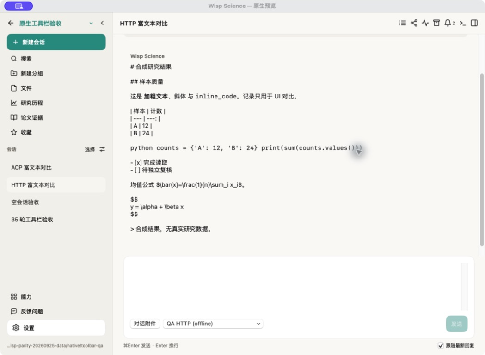
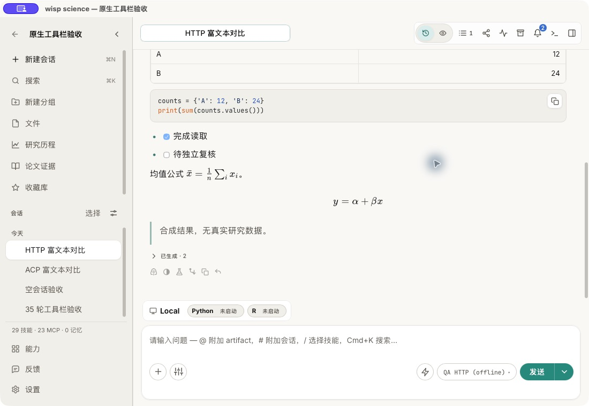

# macOS Native / WebView — 2026-09-25 实机证据

[差异与迭代计划](../../superpowers/plans/2026-09-25-macos-native-parity-iteration.md) · [构建基线](comparison-baseline.json)

源码：`4272578e`；macOS 26.6.2；中文、浅色；使用 Computer Use 操作真实应用，保存工具返回的原始 JPEG。原生默认窗口截图为 1049×768，WebView 为 1100×760；本次评估功能、内容结构和操作可达性，不作像素级对齐或性能结论。

两份隔离数据具有相同合成会话与论文。首次启动会增加默认工作区等内容；不同操作也会更新各副本的已读和活动状态，首页数量/顺序不是对比标准。没有发送模型请求、登录外部账号或运行远程作业。

| 检查 | SwiftUI | WebView |
|---|---|---|
| 首页与布局参考 | [原生首页](native-home.jpg) | [WebView 首页](webview-home.jpg) |
| 富文本：标题、表格、代码、任务列表、公式 | [原生富文本](native-rich-text.jpg) | [WebView 富文本](webview-rich-text.jpg) |
| 论文证据操作深度 | [原生论文](native-publication.jpg) | [WebView 论文](webview-publication.jpg) |
| 模型接入与订阅入口 | [原生模型](native-models.jpg) | [WebView 模型](webview-models.jpg) |
| 项目导入 | [原生归档选择器](native-import.jpg) | [WebView 导入方式](webview-import.jpg) |
| ACP 主会话 | [原生只读状态](native-acp-readonly.jpg) | WebView 路由仅源码交叉确认，未启动 ACP |
| 发送偏好与实际 Enter 行为 | [偏好为 off](native-send-preference.jpg)；[Enter 后两行仍在草稿](native-enter-newline.jpg) | UI 提示 Enter 发送；发送语义由源码交叉确认，本次未发送 |
| 会话管理 | 原生缺口由源码交叉确认 | [会话操作菜单](webview-session-menu.jpg) |

## 最明显的阅读差异

相同回答在原生中保留 block Markdown 标记，并将 fenced code 显示为一行；WebView 显示表格、代码块、任务状态和公式。

## 交互日志

- 原生搜索：Cmd+K → 不移动焦点 → Escape，回到首页。
- 原生设置：添加 API 编辑器 → 立即 Escape，只退出编辑器；再次 Escape，回到父论文页面。
- 原生输入：确认“使用 ⌘Enter 发送”关闭 → HTTP 会话输入 `QA-shortcut-line-1` → Enter → 输入 `QA-shortcut-line-2`；两行都留在草稿，未发送。随后清空。
- 原生导入：打开归档选择器，浏览隔离目录；取消后项目数未因导入增加。
- 窗口恢复：完整原生包 Cmd+W 关闭最后窗口 → Finder 双击同一 app → CUA 定位超时、无可访问窗口；Cmd+Q → 重新启动出现首页。WebView 点击关闭后从 Finder 打开，窗口可用。此项未测试 Dock 或其他 macOS 版本。
- 论文工作区与订阅登录仅检查入口和已存内容，没有新增版本、冻结、编辑证据或登录。

## 环境与范围限制

标准原生构建的资源同步检查失败：缺 19 条新订阅登录英文文案。本次临时构建脚本跳过这一步，保留原样源码与已签入资源；最终两包都编译完成且严格签名校验通过。原生主 app 自报 0.1.0，Rust host 为 1.14.0，详情见基线 JSON。

[首次读取超时](native-read-timeout.jpg)属于 QA 环境记录：数据库初放在 Documents，新签名应用派生的 service 阻塞在系统 `open()`；shell 中同一 service 能快速读取。将合成数据迁移到 `/private/tmp` 后恢复。没有修改系统文件访问权限，不据此断言已经确定产品缺陷。

未做真实模型/ACP/OAuth/SSH/Run 的端到端验证；未完整覆盖所有面板、深色、英文、窄窗、图片附件、长会话性能。静态功能缺口与实机复现的标签详见计划文档。没有执行完整测试套件，也没有修改产品实现。
