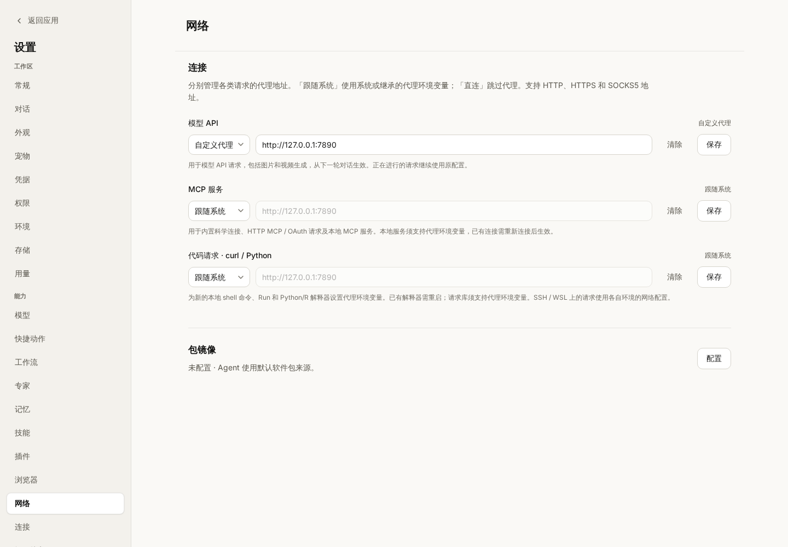
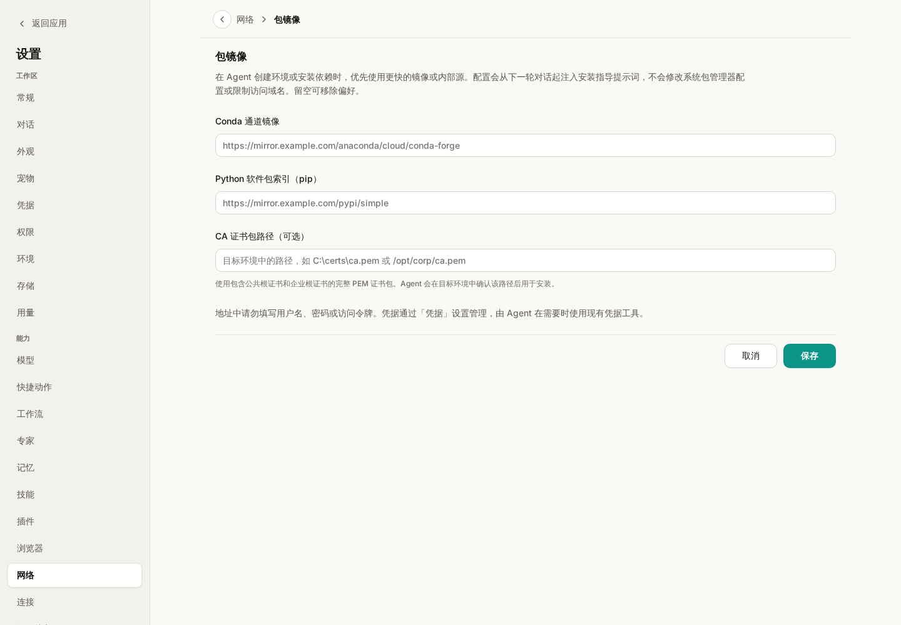

# Network settings

Open **Settings → Network** to configure networking independently of model
profiles. An existing Model API proxy is preserved automatically.

Each proxy has its own mode, address, Clear and Save controls:

| Scope | Applies to | Takes effect |
| --- | --- | --- |
| Model API | Wisp's HTTP model providers, image and video generation | Next turn; active requests keep their current client |
| MCP services | Bundled scientific connectors, HTTP MCP (including OAuth), custom and plugin stdio MCP child processes | New connections; reconnect existing services |
| Code requests | Local shell commands, local Runs, and local Python/R interpreter processes | Newly launched processes; restart an existing interpreter |

**System** inherits the platform or process defaults. Child processes inherit
proxy environment variables; they do not automatically read operating system
proxy settings. **Direct** bypasses proxy discovery. **Custom proxy** accepts an
HTTP, HTTPS or SOCKS5 URL. **Clear** selects System; click **Save** to apply.
Saving one row does not save edits in other rows or in Package mirror. Network
settings can be saved before a model/API key has been configured.

Code proxy settings supply both uppercase and lowercase HTTP(S)/ALL_PROXY and
NO_PROXY variables without changing Wisp's host environment. Libraries must
honor these variables (and may need their own SOCKS support). Code can explicitly
override them: this is a routing preference, not a sandbox or firewall. Existing
Python objects and in-flight MCP connections are not killed on save. SSH/WSL
processes use their own environment; a desktop `127.0.0.1` proxy is not forwarded
to another machine. External ACP agents' own model/shell clients retain their existing networking
configuration. Local MCP servers must support proxy environment variables.

## Package mirror

Select **Configure** under Package mirror to enter a Conda channel URL, Python
package index URL (usually ending in `/simple`), and an optional CA bundle path.
Leave a field blank to remove that preference. Save applies the three fields
together; Cancel discards their edits. Escape immediately returns to Network;
another Escape closes Settings.

These values are installation guidance. Wisp refreshes the system prompt at the
next native agent turn, includes it in native delegated-agent instructions, and
passes it as context to ACP turns. The agent is told to use the configured
Conda/pixi channel or pip/uv index when creating an environment or installing
packages, quote arguments for the target shell, check paths/reachability in the
target context, and explain mirror failures before using public hosts.

This does not rewrite global pip/Conda configuration, change a domain allowlist,
test mirror reachability during settings save, or guarantee package availability.
The optional CA path is interpreted in the installation environment, so it can
be a Windows, macOS, Linux or remote path. Use a complete PEM bundle with public
and corporate roots; TLS verification should remain enabled.

Do not put credentials or access tokens in proxy/mirror URLs. Manage secrets in
**Credentials**; the mirror instructions direct the agent to existing credential
tools when authentication is needed. Proxy authentication is not configured by
this page. All new configuration is stored as one backward-compatible settings
record; the old `proxy_url` value is read only when that record is absent.

## Manual smoke checks

1. Start with an existing model proxy; confirm it appears in Network and is no
   longer editable in Models. Save the MCP proxy and confirm the model value stays.
2. Configure a local HTTP proxy. Use a new local shell/Run and a newly started
   Python interpreter to inspect the proxy variables and make a request against
   a controlled endpoint. On Windows use PowerShell syntax for the shell.
3. Reconnect a custom HTTP and a local stdio MCP service and inspect proxy logs.
4. Set a mirror, ask the agent to set up a project environment, and confirm its
   installation plan uses that source. Clear it and confirm the next turn no
   longer includes the mirror instruction.
5. Open Package mirror and press Escape without focusing its form: only the
   subpage closes. Repeat in Chinese and at a narrow window width.
