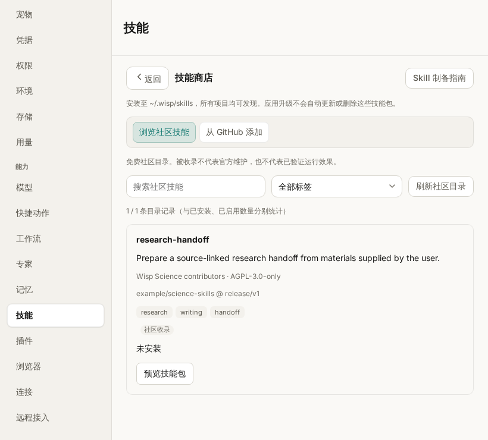

# Skills

For package authors, see the [Skill authoring guide](skill-authoring.md) and
[community directory contribution guide](../community-skills/README.md).

## Community store and GitHub installation

**Settings → Skills → Browse community Skills** opens a searchable, tag-filtered
free directory. **Add from GitHub** accepts a public repository, Skill directory,
or `SKILL.md` file URL. Repository links use GitHub's reported default branch;
ambiguous branch/tag boundaries require an explicit ref. All refs resolve to a
full commit SHA before preview and installation. Select one package from the
results, inspect the full SKILL.md source, dependencies, validation feedback,
origin, and conflicts, then use **Review installation → Confirm and install**.
Repeat for additional packages; the entire repository is never installed as a
batch without selection. The authoring guide is available from the store header.

The store also includes three default marketplace sources: **OpenAI Skills**
([curated directory](https://github.com/openai/skills/tree/main/skills/.curated))
**Anthropic Skills** ([public directory](https://github.com/anthropics/skills/tree/main/skills)),
and **BEAR Research Skills** ([public directory](https://github.com/fei0810/bear-research-skills/tree/main/skills)).
Click a source to load its packages, search the results, and select one to
preview and install. **Load / refresh source** retries or reloads that source;
Escape returns from package details to its results, then to the community directory.
The source buttons are available offline; fetching their packages requires GitHub.
OpenAI's repository is marked as legacy because its README now directs users to
OpenAI Plugins. This entry retains the requested Skill repository, excluding its
Codex system helpers. Anthropic's entry excludes the repository's template folder.
Each package retains its upstream license and dependencies; listings do not imply
Wisp runtime compatibility or install any Claude/Codex plugin integrations.

The eight `bear-*` research Skills are no longer bundled with Wisp. Install the
ones you need from **BEAR Research Skills** in the store and configure SciMaster
CLI for literature retrieval. Old bundled copies left by an application upgrade
are ignored during discovery, allowing marketplace installs without a stale
name conflict. Existing global, project, extra-path, or plugin copies are
preserved and still discoverable. BEAR's upstream CC BY-NC-SA 4.0 license remains
applicable to packages installed from that source.

Installation copies the complete selected package to `~/.wisp/skills`, where
**all projects can discover it**. Files are staged outside discovery roots and
only made visible after validation. No downloaded scripts execute, dependencies
install, or permissions change during installation. A name collision with any
current source blocks installation and displays the source/path; existing files
and local modifications are preserved. Manage the current package through the
installed Skills list. The store does not implement replacement or auto-update.

The store distinguishes community listings and user-entered sources from bundled
Skills. Format validity, unresolved dependencies, author compatibility claims,
and reported runtime verification are shown separately. Package details preserve
repository, ref, full installed commit, source URL, and package path in local
`.wisp-source.json`; installed details continue showing these when offline.
Directory refresh falls back to the shipped index if GitHub is unavailable.
404, rate-limit, network, and validation errors remain visible. Cancelling a
preview discards its result; no installation occurs until confirmation.
While a preview is being prepared, an inline status card shows a rotating
indicator and a Cancel button. The selected package's Preview button also shows
a spinner and “Previewing…” until completion or cancellation. Escape cancels the pending preview while
keeping the store open. The indicator respects the system's reduced-motion setting.
An accepted installation completes before its confirmation can be dismissed.

On success the current project's index refreshes without restarting Wisp;
existing disabled Skills and tag overrides are preserved. Application updates
and changes to the remote directory do not update or remove user packages.
See the authoring guide for download/preview limits, upgrade ownership boundaries,
historical resource-directory backup guidance, and follow-up work.

Community store (screenshot uses test data):

## Installed Skills

Wisp discovers `SKILL.md` packages from several scopes. The Skills settings
page shows the scope and absolute source path for every discovered skill, and
the Agent's `search_skills` result includes the same `scope` and `path` fields.
For inventory questions, `list_skill_catalog` pages through the complete
discovered or effective view and reports separate discovered, effective,
shadowed, parse-error, and currently searchable enabled counts. Search result
counts must not be interpreted as the configured Skill inventory. The
`current_configured_enabled_count` field is the authoritative count for the
current Agent snapshot. If a user-provided or remembered UI count differs, the
Agent reports the discrepancy instead of inventing an installed/enabled
distinction.

Skills may declare an optional `wisp` YAML mapping with `schema_version: 1`
and controlled `domains`, `research_stages`, `roles`, `evidence_types`,
`outputs`, and `side_effects`. Legacy frontmatter remains valid. Invalid Wisp
semantics are retained as catalog parse-error records instead of silently
entering the effective catalog.

Discovery uses this precedence when two packages declare the same public name:

1. `bundled` — the read-only catalog shipped with Wisp.
2. `project` — `<project>/.wisp/skills` for workflows owned by one project.
3. `global` — `~/.wisp/skills` for workflows shared by all projects.
4. `extra` — directories configured through `WISP_SKILLS_PATH`, in configured
   order.
5. `plugin` — Skills from enabled feature plugins. A plugin never replaces a
   host Skill with the same name.

The Skills toolbar groups search and installation entry points together. The
visible/enabled count and bulk enable, disable, and reload actions sit beneath
it, followed by compact tag filters. Controls wrap to fit narrower windows.
Newly visible rows fade in when filtering; opening a Skill and switching file
previews use brief transitions. Reloading shows a rotating indicator and disables
repeat reloads until the request finishes; file loading also shows an indicator.
These animations respect the system's reduced-motion setting.

**Settings → Skills → Reload skills** rescans all of these locations without
restarting Wisp. Newly discovered Skills are enabled by default. Existing
Skills that the user explicitly disabled remain disabled. Idle conversation
Agents are rebuilt on their next turn, so the new index is used without losing
conversation history or restarting the persistent Python/R runtime.

The **Add skill** action installs or updates a global Skill from a `SKILL.md`
file, a Skill folder, or a ZIP archive. A ZIP may contain `SKILL.md` directly or
wrap one Skill in a single top-level folder. A project Skill can be managed with
the project files under `.wisp/skills` and then loaded with **Reload skills**.
Only global Skills can be deleted from the Skills settings page; project and
extra-path files remain owned by their project or source directory. Plugin
Skills are managed from their plugin card.

Tags declared in `SKILL.md` appear automatically. Tags edited in Settings are a
user override and are also applied to Agent `search_skills` queries after the
next idle-Agent rebuild.

The Skills page has two levels. The catalog lists each Skill's name, scope,
tags, and enable switch; search, tag filters, bulk enable/disable, reload, and
import stay in the catalog. Select a row to open **Skills → Skill name**.
The detail page shows the description and source directory, lets you edit tags,
and offers deletion for user-installed global Skills. Plugin enablement and
removal remain managed by the parent plugin; personal tags can be edited in
the Skill detail page.

In **Files**, select `SKILL.md`, a nested script, or another package resource.
Markdown opens as a rendered preview; **Source** includes the original YAML
frontmatter. Scripts and other UTF-8 text files open as read-only source and
are never executed. Package HTML is escaped and remote images are not loaded.
Hidden entries and symbolic links are omitted from the file list. Preview is
limited to 1 MiB per text file; binary/non-UTF-8 files show an explanation.
The browser supports up to 2,000 files and 32 directory levels, and reads are
restricted to the selected package. Disabled Skills remain browsable.
Use the breadcrumb/back button or Escape to return to the filtered catalog.
If a delete confirmation is open, the first Escape closes only that dialog.

Catalog and detail views (screenshots use test data):

`search_skills` normalizes case and common separators before matching names,
descriptions, and tags. Continuous CJK queries also contribute bounded 2–4
character terms, so ordinary Chinese task descriptions do not have to contain
spaces to find matching Chinese metadata. Agent guidance asks for one retry
with cross-language domain synonyms when the first query has no confident
match. Search is still local lexical retrieval; it does not call an embedding
service or send the Skill catalog to a third party.

The **Capabilities** summary uses the same current enabled Skill inventory and
splits it into bundled and project-added counts. Project-added includes project,
global, extra-path, and project-enabled plugin Skills. MCP counts are split into
bundled packages and enabled custom/plugin services available to the project.

## Scripts and interactive analysis

### Special runtime scripts: `runtime.py` and `runtime.r`

A skill may place `runtime.py` (Python), `runtime.r` (R), or both directly beside
`SKILL.md`. These reserved root-level filenames identify **runtime scripts**:
their code runs inside the selected persistent `python` or `r` interpreter,
so helpers and in-memory state remain available to subsequent calls. They
must not be launched as standalone `python runtime.py` / `Rscript runtime.r`
commands or as separate Runs. Use the lowercase filenames shown here for
portable packages, including on case-sensitive filesystems.

`use_skill` and explicit skill selection detect each file independently and
append the corresponding loading instructions. Discovery, file preview, and
skill loading itself do not execute the files. The Agent follows the instructions
before using the helpers: Python uses `exec(compile(...))` in the persistent
namespace; R uses `source(..., local = TRUE, encoding = "UTF-8")` in the
runtime's persistent evaluation environment. If the runtime cannot access the
package path, such as on SSH or WSL, the Agent reads the local file and submits
its contents through the corresponding runtime tool's `code` argument instead.
Sibling resources are not automatically transferred.

Load each sidecar once in the runtime where it is needed. A runtime restart,
different conversation, or different execution context requires loading it
again. Persistence here means interpreter memory, not recovery across process
restarts; save durable results to project files or artifacts.

Authors should keep top-level loading lightweight: define helpers and defer
expensive data loading, computation, dependency checks, and other side effects
until explicit helper calls. Prefix helper/global names to avoid collisions in
the shared language namespace. Python sidecars execute in `__main__`, so an
`if __name__ == "__main__"` block also runs during loading; use an explicitly
called function for demos or self-checks. Python and R retain separate state;
shipping both files does not share objects between languages.

Ordinary files under `scripts/`, such as `scripts/main.py`, have no special
loading behavior, even if named `scripts/runtime.py` or `scripts/runtime.r`.
Document their invocation in `SKILL.md`. Use these for standalone tasks that
do not need persistent state; a skill can include both ordinary scripts and
runtime sidecars. No sidecar is required for a skill.

### Bundled helpers and execution choices

The bundled `public-data-access` skill includes optional geokit guidance for
GEO SOFT/Series Matrix acquisition and R ExpressionSet workflows. Basic GEO
discovery continues through the existing connectors. geokit and Biobase must
be available in the selected execution context when their operations are used;
loading the skill does not install them or add an MCP server. The adapter
guidance covers file selection, transfer limitations, multi-platform outputs,
and provenance. See the [GEO adapter reference](../skills/public-data-access/references/geokit.md).
The plan/manifest helper runs directly as `scripts/public_data_plan.py` with
Python 3.10+; this skill does not need a runtime wrapper. Resolve the
helper from the skill directory and run it with the project as the working
directory.

The `paper-narrative` helper carries each figure's supplied image path with its
claim in both brief and review prompts. The `literature-review` Python OpenAlex
helpers raise on failed or malformed retrieval instead of reporting an empty
search or citation graph; DOI checks retain an explicit unverified state.
Loading `figure-style` helpers leaves the current matplotlib backend and style
alone. Apply the style explicitly with `apply_figure_style(...)`; the optional
`figure_style_self_check()` runs only when called.

The built-in execution guidance and analysis skills describe the available
execution methods without assigning task categories to a default method.
`shell` runs short commands in fresh processes; `run_in_context` manages
standalone background, long-running, or remote work. The `python`/`r` runtimes
retain interpreter state across calls. The Agent chooses according to the
user's workflow, state reuse, script requirements, and task lifecycle, using
the selected environment with either method.

Persistent `python`/`r` tools are appropriate when interactive analysis is
requested or retaining loaded data, models, or expensive intermediates benefits
successive steps. Saved analysis scripts can consume existing objects through
`script_path` with `required_objects`. Moving such work into a Run starts a
fresh process and loses access to those objects, regardless of its duration.
Resumed conversations refresh the built-in execution guidance when their Agent
is constructed, preserving project rules and specialist instructions.

Python `script_path` execution temporarily sets `__file__` to the source path
resolved against the runtime working directory and restores the previous
binding afterward. `sys.exit()` and `sys.exit(0)` complete the script without
failing the cell or stopping the worker; other exit values remain errors.
Variables remain in the conversation's runtime. This is not full command-line
emulation: it does not configure script arguments or import paths. On SSH, the
source path is logical: only source content is sent, and sibling files are not
deployed. Use standalone execution for scripts requiring normal CLI behavior
instead of adding REPL compatibility branches to the script.
