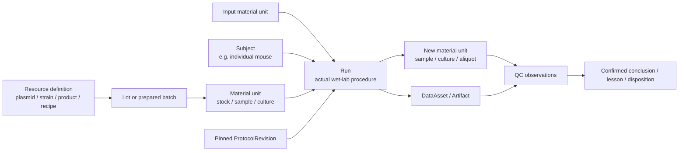

# Wet-Lab Provenance and Resource Ledger

**Date:** 2026-07-11

**Status:** Implemented for the acceptance scope in Sections 13, 16, and 17. The
current code includes registry identity and transactions, inventory and locations,
conversation-bound wet-lab Runs, immutable protocol publication/pinning, deviations,
Subject participation, material derivation DAGs, reservations, typed external data
evidence, QC observations/assessments, confirmed Decisions, closeout and Amendment
history, three-way dossier import, protected projection paths, bulk templates/output
manifests, QR labels, unified provenance queries, Today/Bench UI, and the North-star
conversation test. Full Rust workspace tests, wasm32 UI checking, and the mocked
Playwright suite are the completion gates.

**Scope:** Extend wisp-science from computational provenance into day-to-day wet-lab
resource, sample, protocol, QC, and data provenance without turning the first change
into a full LIMS or regulated ELN.

## 1. Product decision

The user request is directionally correct: a biologist should be able to say what
they are doing in ordinary language and obtain a durable, searchable record of:

- which physical resources and exact lots were used;
- which protocol version was actually followed and where it deviated;
- which samples, data, and artifacts were produced;
- where each physical object is now and whether it is usable;
- which QC evidence, conclusions, and lessons apply;
- where every object came from and where it was used next.

The recommended architecture is **not** “let the Agent freely edit a directory of
Markdown files.” It is:

> conversation as the capture surface, a typed `LabTransaction` as the unit of
> change, one SQLite domain store for current state, history, and narrative, and
> Markdown/Frontmatter as a portable materialized view.

This preserves the best part of the filesystem prototype—readability, Skills,
scripts, templates, Git portability, and easy migration—while adding the identity,
atomicity, validation, and correction semantics required for physical samples and
inventory.

## 2. Fit with the existing control plane

Most of the durable product nouns already map cleanly to wet-lab work:

| Existing noun | Wet-lab role |
| --- | --- |
| `Project` | One research project and its accumulated lab/computational history |
| `Run` | The project-level activity identity for one actual procedure; wet-lab support requires generalizing the current compute-only persistence seam |
| `DataAsset` | Raw instrument data, manifests, remote data, and external references |
| `Artifact` / `ArtifactVersion` | Project publications of ProtocolRevisions, images, reports, tables, maps, and notes |
| `Decision` | A user-confirmed conclusion, disposition, or lesson, linked to evidence |
| `ExecutionContext` | Optional analysis/instrument-computer context; it is not automatically the laboratory bench itself |

Wet-lab ownership needs one administrative scope and one durable scientific noun:

### LabRegistry

A `Project` is a research question, while a freezer, antibody vial, cell line, and
mouse may be shared by several projects. Therefore physical inventory is owned by a
`LabRegistry`, not duplicated per Project. The local-first v0 has one default local
registry, optionally rooted in a user-selected directory, and multiple Projects may
link to it. Display IDs, physical balances, locations, and custody history exist once
at registry scope.

Runs and Decisions remain Project-owned. DataAssets and Artifacts are Project-owned
today; Milestone 5 must add a registry owner scope for pre-project protocol/QC
evidence rather than inventing a hidden “lab ops” Project. Each wet-lab Run is bound
to exactly one linked LabRegistry in v0; every participant, reservation, location,
and inventory transaction in that Run belongs to the same registry. A Run may
participate with registry-owned entities, and optional project-entity links record
relevance/origin without cloning the physical record.

### LabEntity

A `LabEntity` is a numbered, trackable laboratory record. Variants include reusable
resource definitions, batch identities, physical MaterialUnits, individual Subjects,
locations/containers, and shared ProtocolSources. The common envelope provides
identity and revision; only the relevant typed variant owns quantity, location, life
state, source content, or other facets. A reusable product/design definition and a
physical instance are related but are never the same record.

Do not broaden `DataAsset` to include antibodies, mice, and tubes. That would mix
digital references with physical custody and make both models less precise.

Internal supporting records such as `LabEvent`, `QCObservation`, and `QCAssessment`
do not need to become equal-weight top-level product surfaces.

### 2.1 Current implementation constraints

This design describes the target control plane, not capabilities that already exist:

- the current `RunRecord` is compute-centric: `context_id` is mandatory, context
  kinds are only local/SSH/WSL, and lifecycle/lease fields model a process or job;
- `DataAsset`, `Paper`, and `Decision` are currently generic Research Graph nodes
  with unvalidated `metadata_json`, not typed stores;
- the Agent-facing `research_graph` tool can write but cannot query the graph, and
  the UI does not yet expose it;
- Artifacts are tied to a chat root frame; immutable Artifact versions exist in the
  store, but protocol-friendly project ownership, version creation/query APIs, and
  routine checksum population are not complete;
- provenance currently has two separate identity systems: session/path-based
  `execution_log` capture and Run/ArtifactVersion/research-edge lineage;
- the only Frontmatter parser is the deliberately small `SKILL.md` parser; lab
  records require a complete schema-aware YAML parser/serializer;
- SQLite foreign-key enforcement is not enabled on every pooled connection, so new
  relational lab tables must not assume declared foreign keys are currently enough.

Therefore `kind = wet_lab` is a conceptual reuse of the durable `Run` noun, not an
instruction to insert fake `local` compute Runs today. Before Slice 2, generalize the
Run persistence boundary so a wet-lab Run can have no compute context (or a future
explicit laboratory context), does not acquire a process lease, and uses only the
meaningful lifecycle transitions. Do not create a permanent second activity graph,
but a temporary lab-specific table projected as a Run is acceptable during migration.

Similarly, a Project publication of a registry ProtocolRevision needs Artifact
ownership independent of a conversation. Do not create hidden chat frames merely to
satisfy the current `root_frame_id NOT NULL` constraint.

## 3. Domain model

The **experimental derivation** subgraph is a bipartite DAG:
input MaterialUnit -> Run -> newly produced MaterialUnit. Direct `derived_from` links
may be materialized for fast queries, but the Run remains the evidence-bearing
activity in the middle. Definition-to-Lot membership, Lot-to-MaterialUnit membership,
custody, quantity, location, reservations, observations, and repeated use are other
typed relations; they are not all derivation edges and must not be forced into the
same DAG. Receipt, birth, and legacy-import events are valid derivation roots.



### 3.1 Common identity envelope

Every numbered LabEntity has a common identity envelope:

- immutable internal UUID/ULID primary key;
- immutable registry-scoped display ID;
- `registry_id`, human name, aliases, and external/vendor IDs;
- zero or more Project associations without duplicated physical state;
- entity kind and subtype;
- current revision;
- optional Markdown projection path;
- `created_at`, `updated_at`, actor, and last transaction ID.

The shared envelope enables search and references. Type-specific rules still live in
typed Rust models and normalized columns; arbitrary YAML or an unvalidated EAV bag
must not become the domain model.

### 3.2 ResourceDefinition

Describes “what this is,” not a consumable physical object:

- plasmid construct/design;
- mouse strain or line;
- cell-line identity;
- antibody/kit commercial product;
- buffer/media recipe;
- other reusable material specification.

A definition can have many vendor or internally prepared lots. It cannot be
consumed, moved, depleted, or assigned to a freezer slot.

### 3.3 Lot and MaterialUnit

`Lot` records a single vendor lot, received batch, plasmid prep, or internally
prepared batch. Lot-scoped fields include catalog/lot number, supplier, preparation
Run, received/prepared date, expiry date, and lot-scoped QC. A Lot is a batch identity,
not the physical holding whose balance is decremented; it is never consumed directly.

`MaterialUnit` is the smallest physical material portion the MVP tracks independently.
It has one identity, one primary vessel description, one effective location, quantity,
unit, availability, and custody history. Its usage class is `inventory` or `sample`;
cell culture is a sample subtype. This avoids creating one “Sample” identity and a second physical-unit identity
for the same tube. A kit may initially be one MaterialUnit measured as a box or
remaining-reaction count; component-level inventory is not required.

Splitting or aliquoting a MaterialUnit creates new MaterialUnits. The parent remains
in history, and any residual parent quantity is recorded explicitly.

Quantities use a canonical decimal string and a controlled, versioned unit registry
(an MVP subset of UCUM-style units and dimensions). Automatic conversion is limited
to explicit same-dimension factors, such as uL to mL. The system never infers
mass-to-volume from concentration or density. Quantity may be `unknown` or
`not_measured`; full-object consumption is still recordable, but numeric partial use
or reservation requires a measured compatible quantity.

### 3.4 Sample and culture

A user-facing `Sample` is a MaterialUnit whose origin/usage class is experimental
sample material. It is not a second row layered over the same tube. Each realized
output obtains a new identity. Passage, split, merge, pool, and aliquot actions create
new MaterialUnits and graph edges; they do not overwrite lineage on the parent.

An active cell culture is a sample-class MaterialUnit with culture subtype, derived
from a cell-line definition and a vial or prior culture. Passage number is therefore
an output property of an actual procedure, not just a mutable counter on the cell-line
definition.

### 3.5 Subject

An individual mouse is a `Subject`, not a stock aliquot. It has an independent life
state and may participate in a Run as `subject`, `source`, or `observed`. Tissue or
biospecimens collected from it are output MaterialUnits with sample usage class.

The first version may record strain, sex, date of birth, genotype, cage, and life
state, but is not a full breeding/pedigree or colony-management system.

### 3.6 Location and container

Locations form an acyclic hierarchy such as:

`room -> freezer -> shelf/rack -> box -> slot` or
`room -> incubator -> rack -> plate -> well`.

The unique modeling rule is:

- `MaterialUnit` is the material identity and balance;
- a tube, vial, or bottle holding only that unit is vessel metadata on the
  MaterialUnit and does not receive a second ID by default;
- an addressable holder with child positions—box, plate, cage, rack, freezer—is a
  location/container node; its slot or well is the MaterialUnit's location;
- an empty reusable vessel is a separate Container only when the lab truly needs to
  track that vessel independently.

Moves are ledger events. A physical object has at most one effective location at a
time, and a single-occupancy slot cannot contain two objects. Expiry is derived from
dates, not a manually maintained status that can become stale.

### 3.7 ProtocolRevision

The registry owns the shared protocol identity and mutable working source. Publishing
creates an immutable, registry-scoped `ProtocolRevision` with a monotonic revision
number, exact content-addressed bytes, and mandatory checksum. A Project Run pins
that revision. A project-owned ArtifactVersion may publish/reference the same bytes
for the existing control plane, with an explicit publication link. Editing the
registry source later must not change either record. Closing an ad-hoc Run likewise
publishes its actual instructions as a new immutable ProtocolRevision.

An ArtifactVersion row that points to an overwriteable workspace path is not an
immutable protocol. Both the revision and any ArtifactVersion publication verify the
same hash. The mutable working file may continue to evolve separately. A reference
such as `PRT-000017@3` therefore means registry ProtocolRevision 3, not a
project-local Artifact version number.

A Skill may guide the Agent through a protocol, but the Skill itself is not the
executed protocol record; Skills evolve, while a completed Run must retain the exact
version it used.

In v0, one wet-lab Run pins exactly one primary ProtocolRevision. A protocol revision
may contain internal ordered steps, but independently reusable procedures are linked
Runs rather than multiple unrelated protocols on one Run. QC methods pin their own
method revision on QCObservation/QCAssessment records.

### 3.8 Run participation

`Run.input_refs_json` is not sufficient for wet-lab lineage. Each Run participation
record needs:

- direction: `input` or `output`;
- exactly one participating MaterialUnit or Subject reference; ResourceDefinitions and
  Lots are never direct consumable participants;
- role: `sample`, `reagent`, `subject`, `control`, `product`, or `waste`;
- direction-constrained effect: inputs use `observed`, `returned`,
  `partially_consumed`, `fully_consumed`, `transformed`, or `sampled_from`; outputs
  use `produced` or `produced_as_waste`;
- actual decimal quantity and compatible unit when applicable;
- the transaction/event that established the link;
- optional `transformation_group` for associating subsets of inputs and outputs in a
  plate, split, or pool operation.

Inputs and outputs are separate rows; one participation row never contains both a
source and output entity. Effects are constrained by direction and kind, so a Subject
can be observed or `sampled_from` but cannot be decremented like reagent stock.
Digital data is linked through existing Run/Artifact/DataAsset relations rather than
pretending it is a physical LabEntity participant. Lineage is derived through the Run
and optional transformation group.

The existing `runs.status` remains the only lifecycle authority; `lab_runs` does not
copy it. The wet-lab profile maps user language onto the existing enum:
`planned -> draft`, `in_progress -> running`, `completed -> succeeded`,
`aborted -> failed`, and `cancelled -> cancelled`. `submitted`, `cancelling`,
`timed_out`, and `lost` are invalid/hidden for wet-lab Runs. App restart must not mark
a physical wet-lab Run `lost` merely because no local process can be reattached.
Completion records that the activity ended and does not imply QC pass; output
MaterialUnits and data may exist even when the Run failed or was aborted.

### 3.9 QCObservation and QCAssessment

QC separates what was measured from how it was judged. An immutable `QCObservation`
records:

- target LabEntity, Run, or DataAsset;
- method and pinned method/protocol version;
- measurement/value and unit;
- raw evidence Artifact/DataAsset;
- operator, `occurred_at`, and `recorded_at`.

An append-only `QCAssessment` references one or more observations and records the
criterion/threshold snapshot, assessor, evidence scope, and verdict: `pending`,
`pass`, `conditional`, `fail`, or `not_applicable`. Neither record is updated in
place. Reassessment appends a new assessment referencing the same observation(s), so
a later pass never erases an earlier fail. The UI may cache a derived quality summary.
`Run = completed` means execution finished; it does not imply QC passed.

QC records targeting registry entities are registry-owned. Evidence produced by a
Project Run may point to that Project's Artifact/DataAsset; receiving/lot QC that
predates a Project needs registry-owned Artifact/DataAsset evidence. The current
Project-only owner model cannot represent that honestly, so structured QC remains
post-v0 and Milestone 5 generalizes owner scope before shipping it.

## 4. Type examples

| User-facing type | Definition | Physical/derived records | Typical QC/evidence |
| --- | --- | --- | --- |
| Plasmid | construct | prep Lot, tube/aliquot MaterialUnits | sequence/map Artifact, concentration, digest, sequencing |
| Cell line | line identity | vendor-vial and culture MaterialUnits | mycoplasma, identity, morphology, passage |
| Antibody | target/clone/product | vendor Lot, vial/aliquot MaterialUnits | lot-scoped validation, dilution, application |
| Kit | product/catalog | vendor Lot, kit MaterialUnit | expiry, remaining reactions, control outcome |
| Buffer | recipe | prepared Lot, bottle/aliquot MaterialUnits | pH, concentration, preparation/expiry dates |
| Mouse | strain/line | individual Subject | genotype, health/observation, tissue MaterialUnit outputs |

## 5. State model

Do not compress all meaning into one `status` string. At minimum keep orthogonal
facets:

- lifecycle: `planned`, `active`, `depleted`, `discarded`, `lost`, `void`;
- availability: `available` or `quarantined`;
- identity state: `verified`, `suspect`, or `mislabeled`, with replacement/label
  mapping when applicable; `void` is reserved for an identity never realized or
  created in error;
- quality summary: derived from immutable observations and append-only assessments;
- subject life state where applicable: `alive`, `transferred`, `euthanized`, `dead`.

Reservation is not a boolean state. A `lab_reservations` row allocates an exact
MaterialUnit and decimal quantity (or the whole non-quantified object) to a Run, with
active/released/expired status and optional expiry time. Available balance is computed
atomically as on-hand quantity minus active reservations. Competing reservations
cannot over-allocate, and closing/cancelling a Run releases unused allocations.

Planned outputs and preallocated labels are not yet physical samples. When the
experiment ends, they become `active` only if the user confirms they were actually
produced; otherwise they become `void`. IDs are never reclaimed.

## 6. Identity and numbering

Use two identities:

1. UUID/ULID as the immutable internal key and future synchronization identity.
2. A short registry-scoped display ID such as `PLS-000123`, `LOT-000184`,
   `MOU-000321`, `SMP-001284`, or `RUN-000231`.

Rules:

- allocate numbers transactionally from `(registry_id, prefix)` counters;
- allow gaps, never reuse a number, including voided records;
- do not encode date, freezer location, passage, or lineage in the identifier;
- preserve vendor catalog numbers, vendor lots, and legacy IDs as aliases;
- reclassifying an entity does not rename its existing display ID;
- labels can add barcode/QR and a check character later without changing identity.

Do not use `SELECT MAX(id) + 1`; Agent retries and concurrent imports must use an
idempotency key and an atomic allocator.

Aliases have typed uniqueness rules. Registry barcodes and namespaced legacy/internal
IDs are unique. Vendor lots use a composite supplier + catalog + lot key rather than
claiming the lot string is globally unique. Free-form names/aliases may repeat; a
query returns all candidates and any mutation requires explicit disambiguation.

## 7. Persistence shape

The exact SQL belongs in an implementation plan, but the durable seams should be:

| Table/service | Responsibility |
| --- | --- |
| `lab_registries` | Shared inventory ownership scope and optional dossier root |
| `lab_registry_projects` | Link many research Projects to a registry |
| `lab_entities` | Registry-owned identity, kind, name, revision, projection path |
| `lab_entity_projects` | Optional Project relevance/origin without cloning physical state |
| `lab_resource_definitions` | Reusable construct/product/strain/recipe fields |
| `lab_lots` | Vendor or internally prepared batch identity and lot-scoped fields |
| `lab_material_units` | Physical inventory/sample/culture quantity, vessel, and location |
| `lab_subjects` | Individual subject identity and life-state fields |
| `lab_aliases` | Vendor, legacy, barcode, and user aliases |
| `lab_locations` | Acyclic location/container hierarchy and occupancy |
| `lab_protocols` | Registry-owned shared ProtocolSource path/current hash |
| `lab_protocol_revisions` | Immutable registry revision number, content blob, and checksum |
| `lab_protocol_publications` | ProtocolRevision to Project ArtifactVersion publication |
| `lab_runs` | Sidecar for `runs`: registry, display ID, operator, protocol snapshot, deviations |
| `lab_run_participants` | One MaterialUnit/Subject per typed input/output row |
| `lab_reservations` | Per-Run MaterialUnit quantity allocations, release, and expiry |
| `lab_qc_observations` | Immutable measurements/methods and raw evidence |
| `lab_qc_assessments` | Append-only criteria snapshots and verdicts over observations |
| `lab_research_links` | Versioned direct links from registry entities to Project research nodes |
| `lab_transactions` | Idempotent command, actor/source, approval, status, and durable receipt |
| `lab_events` | Ordered append-only events belonging to a transaction |
| `lab_documents` | Entity/Run narrative/extensions plus last-projected base content/hash/mtime |
| `lab_id_counters` | Atomic registry/prefix display-ID allocation |
| `lab_projection_outbox` | Crash-safe Markdown materialization/retry queue |

Key common fields on `lab_transactions`:

- `id`, display ID, required `registry_id`, optional `project_id`/Run reference, and
  registry-scoped unique `command_id`/idempotency key;
- transaction/receipt schema version;
- actor kind/reference and optional source frame/message;
- risk class, confirmation/approval evidence, commit status, and receipt payload;
- `created_at` and `committed_at`.

Key common fields on `lab_events`:

- `id`, `registry_id`, optional `project_id`, `transaction_id`, and sequence number with a unique
  `(transaction_id, sequence)` constraint;
- optional entity, Run, and prior-event references;
- event kind, explicit event schema version, and schema-validated payload;
- `occurred_at` and `recorded_at` as separate values;
- expected and resulting entity revision;
- correction/amendment reference and reason.

MVP does not require full event sourcing. The authoritative local store is the whole
SQLite domain model: typed current-state rows own present structured state,
`lab_documents` owns narrative and preserved extension fields, and immutable
transactions/events explain historical changes. The same commit updates current
state, document metadata when applicable, and ordered events. Application code does
not update or delete committed transactions/events. Markdown can be rebuilt from
current rows plus `lab_documents`; event replay is not required for ordinary reads.

Each `lab_documents` row targets exactly one `lab_entity_id` or one wet-lab `run_id`
(a ProtocolSource is already a LabEntity), carries the matching registry and optional
Project owner, and enforces that exclusive target constraint. Daily pages are derived
views and have no independent narrative authority.

### 7.1 Research Graph bridge

The existing Research Graph remains the project-level semantic graph. Fine-grained
inventory/sample lineage stays in the lab tables so a 384-well experiment does not
force the existing whole-project graph API to load every MaterialUnit.

The bridge is:

- a wet-lab `Run` is the existing Run and therefore an existing research node;
- `lab_run_participants` links physical entities to that Run;
- existing `run_artifacts` and research edges link the Run to Artifacts, DataAssets,
  Papers, and Decisions;
- an optional `lab_research_links` table supports a direct conclusion or paper link
  to a specific LabEntity when traversing through a Run is insufficient.

Lab-domain relations use a versioned closed vocabulary with allowed endpoint kinds,
direction, and cardinality. They must not inherit the current Research Graph's
“arbitrary non-empty relation string” behavior for inventory or lineage invariants.

The Agent query layer exposes one union traversal without requiring the user to know
which table owns each edge.

Lab events must not become a disconnected third provenance system. Stable Run,
LabEntity, ProtocolRevision, ArtifactVersion, and DataAsset IDs are the join keys. The existing
session/path execution log remains useful supporting evidence for code execution, but
paths alone are never the identity of a protocol, sample, or data product.

## 8. LabTransaction and Agent tools

All structured mutations go through the domain service, including mutations
originating from the Agent, UI, manifest importer, or externally edited Frontmatter.
The enforced boundary is the SQLite domain API, not filesystem tamper prevention:
generic `write`/`edit` tools additionally reject registered dossier paths to prevent
accidents, while shell commands and external editors may still change files. Any such
change is an untrusted projection edit and never changes database state directly.
Agent narrative changes go through a dedicated document/domain command that merges
`lab_documents`; all other file edits enter only through the validated import flow.

Two tool surfaces keep permissions and model behavior clear:

- `lab_query`: search, get, today, location, timeline, ancestors, descendants,
  quality evidence, and unresolved items; always read-only.
- `lab_transaction`: validate a typed change set, produce a domain diff, request
  confirmation when required, atomically commit state plus audit events, and return
  a transaction receipt.

Every transaction includes `command_id` and expected revisions. A repeated Agent
tool call returns the original receipt rather than consuming inventory twice.

Example change set for an experiment closeout:

```text
TXN-000991
  consume 20 uL from MAT-000312 (antibody, LOT-000184)
  record deviation on RUN-000231
  create SMP-001842 .. SMP-001847
  link six outputs to RUN-000231
  register DAT-000882 manifest + checksum
  append six QC observations
```

The database commit is atomic. Markdown projection happens through an outbox after
commit; projection failure never rolls back a real-world action, and startup can
retry it without duplicating IDs or quantity changes.

## 9. Confirmation policy

Conversation should remove form-filling friction, not remove verification.
Approvals must show a domain diff rather than the generic “Run tool?” prompt.

This requires a structured `DomainConfirmationRequest` seam before write tools ship:
command/transaction ID, affected stable IDs, before/after fields and quantities, risk
class, assumptions, missing data, and available actions. Tauri renders the structured
card; headless/CLI callers receive a deterministic text fallback. The current
`confirm_decision(&str)` and generic file-diff event are not sufficient contracts for
lab mutations, even if the richer visual treatment arrives in a later UI slice.

| May happen automatically | Needs a grouped domain confirmation | Never silent |
| --- | --- | --- |
| Search, lineage, summaries | Reserve/consume/replenish inventory | Delete or rewrite audit history |
| Draft plan and expected outputs | Start/close/cancel a Run | Guess a lot, mouse, or ambiguous sample |
| Record verbatim observation/deviation | Create/merge/split/discard physical samples | Reuse a voided ID |
| Allocate draft IDs | Move custody/location or print labels | Turn Agent inference into observed fact |
| Checksum and deterministic file matching | Publish a ProtocolRevision or pin changed protocol bytes | Sign ethics/safety/compliance for the user |
| Read-only QC analysis/report draft | QC disposition, quarantine, or Decision | Treat failed Run outputs as nonexistent |
| Update Markdown projection from committed state | Correct a closed record | Rewrite a published ProtocolRevision |

The confirmation card shows affected IDs, before/after quantities and states,
evidence, assumptions, and missing fields. Confirm at meaningful experiment
milestones rather than interrupting once per tube.

A Run-start confirmation always shows the exact ProtocolRevision ID and checksum. The
Agent never silently publishes the current mutable source as a new revision merely to
make the Run start.

If identity is ambiguous, the Agent asks only the smallest disambiguating question.
It never selects an antibody lot or individual mouse from a fuzzy name. Missing
optional data becomes explicit `unknown` or `provisional`, not a guessed value.

## 10. Filesystem and Frontmatter interoperability

Registry-owned dossiers exist once, outside any one research Project. Project-owned
experiment records stay in the Project workspace. A simple single-project setup may
choose adjacent roots, but ownership remains explicit:

```text
<lab-registry-root>/
  resources/       # definitions and lots
  materials/       # human-scale inventory/sample/culture dossiers
  subjects/        # individual animal/subject dossiers
  locations/       # freezer/box/plate/cage hierarchy
  protocols/       # shared mutable protocol sources; Runs pin Project snapshots

<project-root>/lab/
  experiments/     # one projection per wet-lab Run
  daily/           # generated day views, not an independent fact source
  manifests/       # plate/sample/instrument tables and large-data references
  references/      # ID-based links into the registry, never duplicate balances
```

The registry root is an explicitly user-selected capability, not an expansion of the
Agent's ordinary project filesystem scope. Only the registry domain,
projection/import, and protocol-snapshot services may access it. They canonicalize
the configured root and candidate path, reject escapes through symlinks/reparse
points, handle Windows case/UNC semantics, and use safe relative paths. Generic
read/write/edit/shell tools remain scoped to the active Project; `lab_query` returns
structured registry content without granting raw registry-root access.

Each Markdown dossier is a current-state view:

```yaml
---
schema: wisp.lab/material-unit/v1
id: SMP-001842
internal_id: 01J2W...
registry_id: LAB-LOCAL
revision: 7
kind: material_unit
usage_class: sample
subtype: RNA
lifecycle: active
availability: quarantined
aliases: [M23-04-RNA-A]
quantity: { value: "35", unit: uL }
location: LOC-000088
produced_by: RUN-000231
protocol: PRT-000017@3
last_transaction: TXN-000991
---

## Notes

User-authored narrative remains here.
```

Rules:

- `schema`, internal/display IDs, revision, lineage, quantities, locations, and audit
  references are system-managed fields;
- stable IDs, not file paths, are the identity and link target;
- the user owns narrative sections and unknown Frontmatter fields are preserved;
- Agent-generated sections are clearly delimited and patched, never whole-file
  rewritten;
- an external structured-field edit is parsed into a candidate domain command;
- harmless narrative edits may import automatically; identity, inventory, custody,
  status, and provenance edits require validation and usually confirmation;
- `revision` plus a persisted last-projected base snapshot (or content-addressed base
  blob), hash, and observed file mtime enables a real three-way conflict view instead
  of silent last-write-wins;
- writes use a same-directory temp file, flush, platform-specific replace
  (`ReplaceFileW`-style behavior on Windows, rename on macOS), and bounded retry for
  editor locks; failure leaves the outbox pending;
- a projection can always be rebuilt from typed current rows plus `lab_documents`.

One Markdown file per identity is useful for human-scale resources. High-volume
plates and thousands of wells should remain individual database identities but use a
tabular manifest and lazily generated dossiers rather than creating tens of thousands
of small files.

Large raw data stays a `DataAsset` reference with URI/path, size, checksum, format,
origin, and producing Run. It is not copied locally merely to make the wiki complete.

### 10.1 Importing the existing filesystem prototype

Provide a non-destructive legacy importer:

1. Select/create the target LabRegistry and scan Markdown/manifests in dry-run mode.
2. Map known Frontmatter through per-type schemas/templates.
3. Preserve existing IDs as aliases; allocate new immutable IDs where absent.
4. Resolve links only when deterministic and report ambiguous/broken references.
5. Record unknown origin as `LegacyImportEvent`, never invent lineage.
6. Show a transaction summary and error report before commit.
7. Leave source files untouched until the user explicitly chooses normalization.

Existing Python scripts remain valuable for schema adapters and bulk manifests, but
their mutations call the domain API rather than writing protected YAML directly.
Project instructions (`.wisp/WISP.md`) and long-term memory remain appropriate for
lab conventions, preferred defaults, and reusable lessons; they are not the sole
record of a sample state, QC result, or physical action.

## 11. Ordinary-biologist workflow

The primary UI is an **experiment bench mode**, not a graph editor. The interaction
contract is that one saved Project conversation represents one themed experiment:

- chat remains central;
- the first wet-lab Run created from a conversation is durably bound to that
  conversation; a conversation cannot silently acquire a second themed Run;
- daily work is recorded as dated event/step groups within that themed Run; a
  replicate or distinct experiment starts a new conversation and receives a new Run;
- the project may have several in-progress Runs in different conversations, but no
  mutation ever falls back to a “most recent Run”;
- the side panel shows `Inputs -> procedure/deviations -> outputs -> data -> QC -> conclusion`;
- IDs render as clickable chips with status, location, timeline, dossier, and evidence;
- “Today” is a derived timeline of Runs and lab events, not a second notebook database;
- transaction cards distinguish `draft`, `awaiting confirmation`, and `committed`;
- bulk samples use a plate/manifest review rather than hundreds of chat turns.

Example day:

1. User: “Today extract RNA from M23-01 to 06 with RNA-kit v3, then Qubit and
   Bioanalyzer.”
2. Agent resolves exact IDs/lots, checks expiry/availability, pins protocol v3, and
   proposes a Run with expected outputs.
3. User confirms once; resources become reserved and the Run starts.
4. “Sample 4 got 50 uL extra lysis buffer; sample 3 fell.” The Agent records the
   first as a deviation and asks only whether sample 3 was quarantined, continued, or
   discarded.
5. At output time the Agent creates confirmed sample identities in bulk, links
   actual quantities and locations, and registers the instrument manifest/checksum.
6. QC analysis records measurements and evidence; the user confirms disposition.
7. Closeout reports unresolved locations, unmatched files, deviations, inventory
   discrepancies, and a draft conclusion/lesson before closing the Run.

Later, “Why is SMP-001842 poor quality?” traverses input lots, actual procedure,
deviations, freeze/thaw or location events, instrument data, thresholds, and confirmed
conclusions. The answer distinguishes user report, instrument measurement, stored
fact, and Agent inference, with every claim linked to evidence.

## 12. Audit and correction model

Physical history cannot be “undone” like text:

- a mistaken field on an open draft may be updated with a revisioned event;
- a wrong lot or quantity on a closed Run creates an `Amendment` referencing the
  original event and identifies affected downstream assets;
- a wrong move creates a compensating move;
- an inventory discrepancy creates an adjustment with reason and actor;
- a physical unit with a wrong label becomes identity-state `mislabeled` and points
  to the corrected/replacement mapping; only an identity never realized becomes
  lifecycle `void`, and neither ID is deleted or reused;
- voiding an upstream record with descendants raises a provenance-integrity issue
  instead of cascading deletion;
- retroactive notes retain both occurrence time and recording time.

Local SQLite append-only application behavior is useful auditability, but it is not
regulatory tamper-proofing. Hash chains, signatures, remote WORM storage, electronic
signatures, and 21 CFR Part 11 claims are explicitly outside the MVP.

The local-first MVP is single-user. `actor` is a provenance label for the configured
local user, Agent, importer, or system process; it is not authentication,
authorization, or an electronic signature. User confirmations retain their source
message/transaction evidence without claiming regulated identity assurance.

### 12.1 Project archive and deletion

The normal action for a lab-enabled Project is **archive**: retain Project Runs and
their links, make project-owned records read-only, and allow later restoration.
Registry-owned entities, balances, locations, dossiers, and inventory events survive
any Project detach and are never cascade-deleted with a research Project.

In v0, hard deletion is blocked when a Project/Run is referenced by registry history;
otherwise the reason for a consumption or output would disappear. A future explicit
purge flow must export the project-related view, retain at least a Run tombstone
(stable ID, title, times, protocol hash, and transaction snapshot) or clearly disclose
the broken lineage, remove only Project links/Project-owned rows, and mark remaining
project-workspace dossiers as `detached`. Reopening those files is a validated legacy
import, never silent reattachment.

## 13. Critical invariants

1. Internal and display IDs are unique, immutable, and never reused.
2. A `ResourceDefinition` or Lot cannot be consumed; only a concrete MaterialUnit can
   have its balance decremented.
3. Every Lot, MaterialUnit, and Subject has exactly one explicit origin event:
   receipt, birth, legacy import, split/aliquot, or Run output, as allowed by kind.
4. The MaterialUnit derivation graph and the location/container hierarchy cannot
   contain cycles; repeated-use, custody, and observation relations are not derivation.
5. Completed Runs and published ProtocolRevisions cannot be overwritten.
6. Split, merge, passage, pool, and transform operations produce new identities.
7. Quantities use decimal values plus dimensional units; incompatible units are not
   implicitly converted and inventory cannot become negative.
8. One physical object has one effective location; single slots cannot be double
   occupied.
9. Run lifecycle and QC quality are independent.
10. Every structured mutation has actor, time, command ID, revision, and audit event.
11. Transactions are idempotent and use optimistic locking.
12. Raw data references include checksum when available; path changes do not change
   identity.
13. Historical events and referenced upstream entities are not hard-deleted.
14. Failed experiments may still produce real MaterialUnits, Artifacts, and DataAssets.
15. A wet-lab Run binds exactly one LabRegistry; every physical participant,
    reservation, location, and inventory event in that Run belongs to that registry.

## 14. Incremental delivery

Do not implement this whole design in one PR.

The slices below are milestones; each lettered item is intended to be a small PR.

### Foundation — storage integrity

- **F1:** run a backward-compatible orphan audit/`foreign_key_check` before enabling
  foreign keys on every pooled connection; repair known legacy cases or fail with a
  clear diagnostic instead of surprising an existing user database;
- **F2:** define explicit delete policy: registry-owned rows use `RESTRICT` or
  carefully chosen `SET NULL`, never Project cascade; guard Project archive/deletion
  when existing ArtifactVersion, Run, execution-log, research, or registry references
  would be broken;
- **F3:** add the structured `DomainConfirmationRequest` host/tool seam with a simple
  Tauri renderer and deterministic headless text fallback.

### Milestone 1 — Registry and transaction kernel

- **1A:** `LabRegistry`, Project links, `LabEntity` identity envelope, registry-scoped
  counters, and no user-facing mutator yet;
- **1B:** `lab_transactions` + ordered `lab_events`, command idempotency, optimistic
  revision checks, durable receipts, and amendment references;
- **1C:** ResourceDefinition plus typed aliases/external IDs, then minimal
  `lab_query`/`lab_transaction` create-search-get actions routed through 1B.

### Milestone 2 — Physical inventory

- **2A:** Lot and inventory-class MaterialUnit creation/receipt/import with decimal
  quantity and dimensional-unit validation; no Run-produced samples yet;
- **2B:** registry-owned location/container hierarchy, occupancy, move history, and
  discrepancy/quantity-adjustment transactions;
- **2C:** lifecycle/availability transitions and correction flows. Reservations wait
  for the Run binding in Milestone 4.

### Milestone 3 — Portable dossiers

- **3A:** complete schema-aware Frontmatter parser/serializer plus `lab_documents`
  canonical narrative, extension fields, and last-projected base snapshot;
- **3B:** outbox-backed materialization, platform-specific replace/retry, registered
  path rejection in generic `write`/`edit`, and validated external-edit import;
- **3C:** dry-run migration of a small legacy Markdown fixture with conflict and
  unknown-field tests.

### Milestone 4 — Wet-Lab Run

- **4A:** generalize the compute-centric Run boundary so wet-lab Runs bind exactly one
  LabRegistry without fake local/SSH/WSL context or process lease; add the
  kind-specific transition profile and exclude wet-lab Runs from process-loss startup
  recovery;
- **4B:** registry ProtocolSource plus immutable, content-addressed ProtocolRevisions;
  optional project ArtifactVersion publications share the mandatory checksum and have
  explicit query/pinning links;
- **4C:** MaterialUnit participants, direction-specific effects, transformation
  groups, deviations, and realized output MaterialUnits; Subject participation is a
  post-v0 extension over the same seam;
- **4D:** per-Run quantity reservations, multiple in-progress Runs in separate
  conversations, one durable conversation-to-themed-Run binding, and grouped
  transaction receipts.

### Milestone 5 — QC, data, and unified query

- **5A:** add explicit Project-or-Registry ownership for Artifact/DataAsset evidence,
  and promote DataAsset fields needed here (URI, role, size, checksum, origin,
  producing Run) out of unchecked conventions or validate them through a typed
  store/service;
- **5B:** immutable QCObservations and append-only QCAssessments with criterion
  snapshots and evidence;
- **5C:** DataAsset/Artifact/manifest links and actual checksum capture; bridge
  session/path execution evidence to stable Run and ArtifactVersion identities;
- **5D:** Agent-readable Research Graph plus union lineage/quality queries rather than
  relying on the current write-only graph tool.

### Milestone 6 — Bench UI, import, and templates

- **6A:** experiment bench mode, conversation-bound themed-Run header, Today timeline,
  resource/material/subject cards, and lineage view;
- **6B:** rich transaction confirmation, correction/discrepancy, unmatched-data, and
  projection-conflict views with mocked Playwright scenarios;
- **6C:** full dry-run import of the existing Frontmatter prototype and built-in
  schemas/templates for plasmid, cell line, antibody, kit, buffer, and mouse;
- **6D:** plate/sample manifest workflows, barcode/QR label rendering, and later
  ISA/RO-Crate-style export adapters.

### First usable v0 cutoff

The first usable v0 stops after the minimum of Milestones 1–4C plus a basic dossier
projection. It includes one local registry, ResourceDefinitions, Lots,
inventory/sample MaterialUnits, locations, immutable protocol snapshots, a wet-lab
Run, exact MaterialUnit consumption, realized outputs, correction events, and chat
queries for balance/location/lineage.

Subject/mouse records, reservations, structured QC, full bench UI, plate manifests,
barcodes, and legacy bulk import remain follow-ups. This keeps v0 useful for one
antibody-or-buffer-to-sample workflow without claiming to be a complete LIMS.

The v0 acceptance test is one conversation that registers an antibody definition,
Lot, vial MaterialUnit, and location; pins an immutable protocol snapshot; consumes a
measured amount in a wet-lab Run; creates one output sample MaterialUnit; writes both
dossiers; then answers the output's origin and the vial's remaining balance. Repeating
the same command ID changes nothing, and a correction appends history rather than
rewriting it.

## 15. MVP non-goals

- full purchasing, billing, scheduling, or equipment control;
- complete mouse breeding/pedigree/colony management;
- human clinical samples or claims of regulatory compliance;
- kit component-level accounting and arbitrary chemical stoichiometry;
- multi-site real-time collaboration and offline conflict merge;
- automatically accepting LLM-generated conclusions as scientific facts;
- copying large remote datasets into the local workspace by default;
- replacing SQLite with a graph database.

## 16. Verification strategy

Use temporary SQLite files/directories, fake actors, deterministic clocks/IDs, and
mocked Tauri commands. No test requires an instrument, scanner, animal facility,
remote server, or network.

High-value tests:

- registry-scoped atomic numbering, gaps allowed, and idempotent Agent retry;
- typed alias uniqueness plus ambiguous free-alias/lot rejection;
- decimal round-trip, same-dimension conversion, unknown quantity, and
  negative/incompatible quantity rejection;
- cross-registry Run participant/transaction rejection;
- split/pool/passaging provenance and origin uniqueness;
- Subject participation that does not imply consumption;
- location-cycle and double-occupancy rejection;
- completed-Run immutability plus Amendment behavior;
- immutable protocol bytes/hash after the registry source changes;
- QCObservation/QCAssessment history and Run/QC state independence;
- project archive/hard-delete guard that preserves referenced registry history;
- structured confirmation DTO plus headless fallback;
- projection retry after simulated crash or Windows editor lock, unknown Frontmatter
  preservation, stored-base three-way diff, and revision conflict detection;
- registry-root containment tests for symlink/reparse/case path escapes;
- manifest import all-or-nothing behavior with row-level error reporting;
- Playwright flow for plan -> confirm -> deviation -> outputs -> QC -> closeout ->
  provenance question.

## 17. North-star acceptance scenario

A biologist can register an antibody definition, its exact vendor lot and vial,
register a cell-line vial and culture, start a wet-lab Run by conversation, pin a
protocol, record an in-procedure deviation, consume the exact stock quantity, create
new Sample IDs, assign freezer locations, attach a remote raw-data manifest and QC
report, confirm a conclusion, and close the Run.

They can then ask where any output came from, which lots and actual protocol produced
it, what deviations and QC evidence exist, where the raw data lives, where the sample
is now, and which later Runs used it. The same records are readable as Markdown, but
manual file edits cannot silently corrupt identity, inventory, or provenance.
