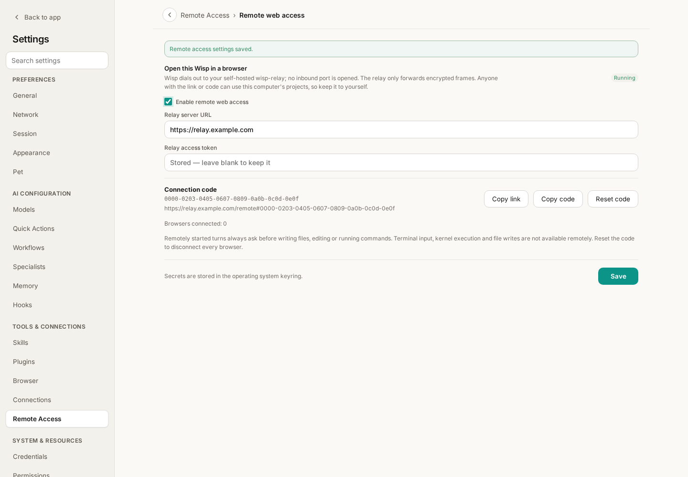
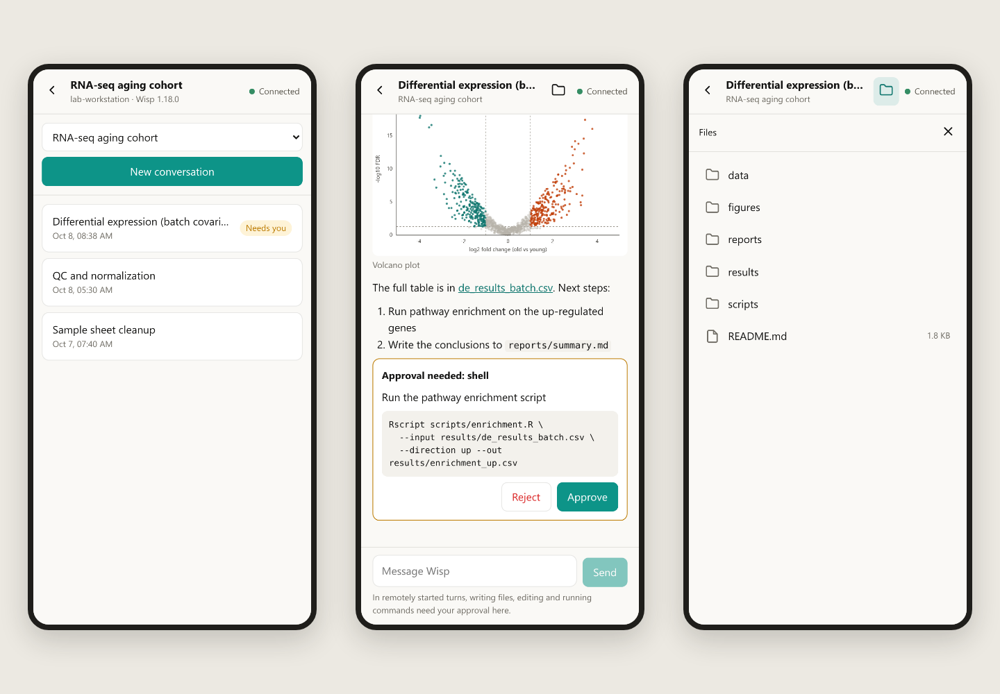
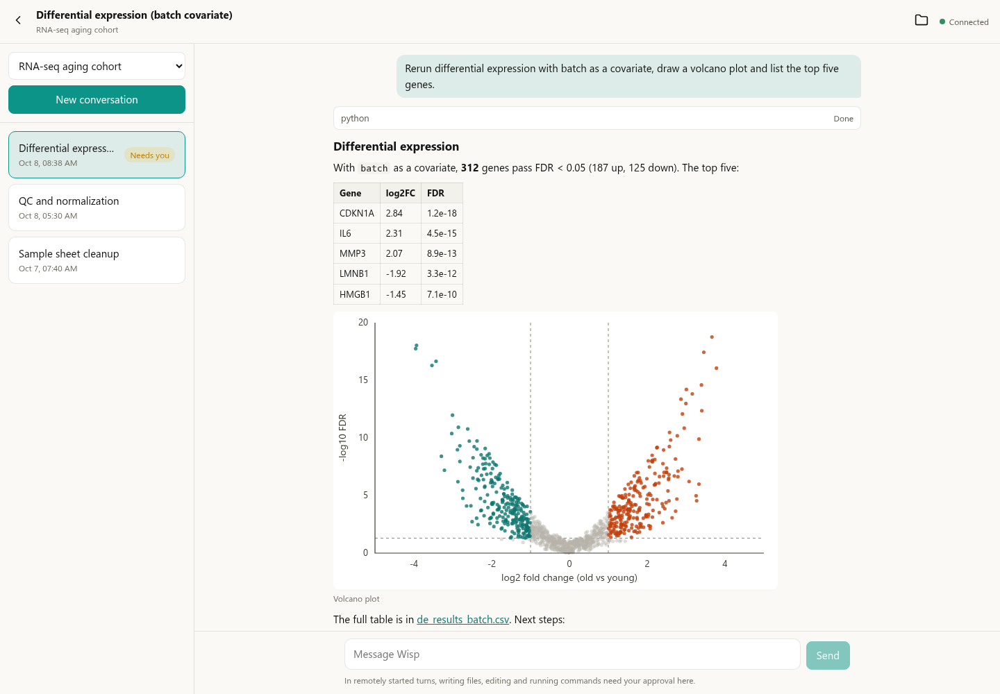
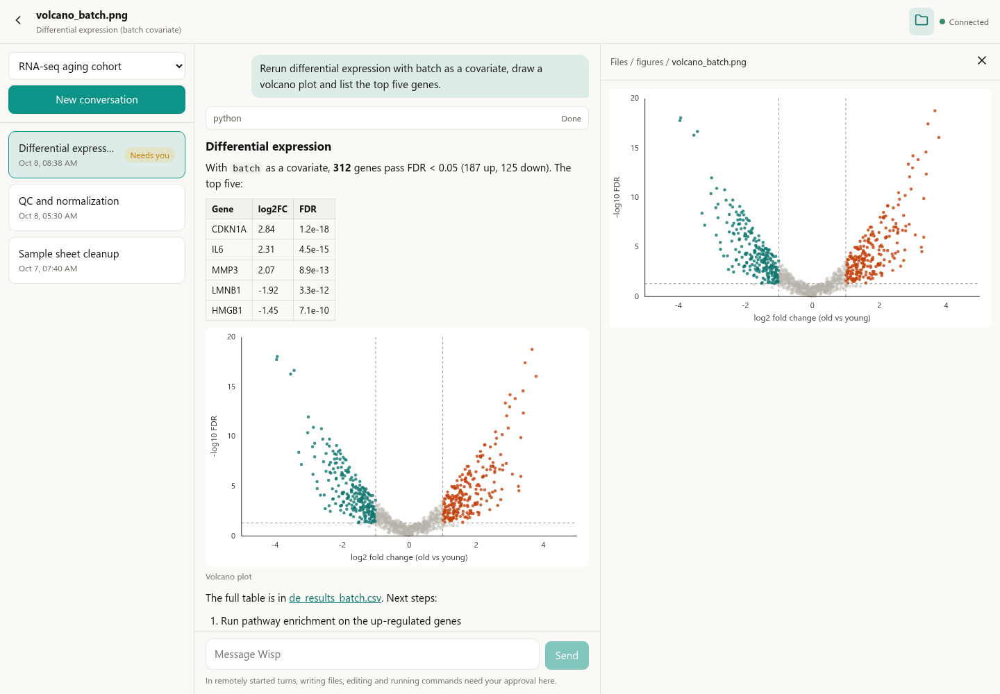

# Wisp Science Advanced: Use Wisp from a Phone or Browser

The analysis is running on the lab workstation, and you are in a meeting room, at lunch, or on the way home. What you want is usually three small things: see how far it got, look at the figure it just produced, and press Approve so it can continue. None of that is worth a trip back to the computer.

**Remote web access** in Wisp Science covers that distance. You open a web page on a phone or in any browser and use the Wisp that is running on your computer: switch projects and conversations, read replies, look at figures, preview files, send messages and answer approval requests. Computation, files and model calls stay on that computer; the page is a window onto it.

This tutorial deploys a relay server, turns remote access on in the desktop app, and then shows what the page does on a phone and in a desktop browser, and what it deliberately leaves out.

> Screenshots show the real frontend in English with demonstration projects, conversations, figures and files. `relay.example.com` is a placeholder domain, and the connection code in the screenshots is an example that connects to nothing. Remote web access was added after v1.18.0 and needs a newer desktop version.

**Meet the three parts first.**

```
phone / browser ──HTTPS──▶ relay server ◀──dials out── Wisp on your computer
```

| Part | Where it runs | What it does |
| --- | --- | --- |
| Desktop Wisp | Your computer or workstation | The actual work: runs the agent, reads and writes files, calls models |
| Relay server `wisp-relay` | A public server with a domain | Lets the page and the computer meet; forwards encrypted data only |
| Web page | A phone or any browser | Shows content and sends your instructions |

The computer dials out, so it needs no public IP address and no port opened on a router. The relay cannot read conversations and never receives the connection code: every frame it forwards is ciphertext. One relay can serve several computers, each told apart by its own code.

**Step 1: deploy the relay on a server.**

You need a server reachable from the internet, a domain that points to it, and ports 80 and 443 open. Browsers only allow the page's encryption on HTTPS pages, so the relay must sit behind HTTPS; the setup below uses Caddy to obtain and renew the certificate automatically.

Save this as `compose.yaml` and replace `relay.example.com` with your domain:

```yaml
services:
  relay:
    image: ghcr.io/xuzhougeng/wisp-relay:latest
    restart: unless-stopped
    environment:
      WISP_RELAY_TOKEN: ${WISP_RELAY_TOKEN:?set a long random token}
    volumes:
      - relay-data:/data
  caddy:
    image: caddy:2
    restart: unless-stopped
    command: caddy reverse-proxy --from relay.example.com --to relay:8787
    ports:
      - "80:80"
      - "443:443"
    volumes:
      - caddy-data:/data
volumes:
  relay-data:
  caddy-data:
```

Then create the access token and start it:

```bash
echo "WISP_RELAY_TOKEN=$(openssl rand -hex 32)" > .env
docker compose up -d
```

The token in `.env` goes into the desktop app next; treat it like a password. Only a computer that holds the token can register with this relay, so strangers cannot use it as a free tunnel.

The image runs on both x86 and ARM servers. `latest` is the newest release; if your desktop app was built from the development branch, or the pull fails with `latest: not found` (the tag appears with the next release), change the image tag to `:main`. If the server already runs a reverse proxy such as nginx, or you want to build the image yourself, see the reference linked at the end.

**Step 2: turn on remote access in the desktop app.**

Open **Settings → Remote Access → Remote web access**, enter the relay server URL (`https://your-domain`) and the access token from the previous step, then check **Enable remote web access**.



*Figure 1: “Running” means the computer has reached the relay. The URL and connection code are demonstration values; a saved token is never shown in the field again.*

Once the state reads “Running”, the page shows a **connection code** and a complete link. Press **Copy link** and send it to your own phone.

- The connection code is the key. Anyone with the link or the code can use this computer's projects, so keep it to yourself.
- The token and the code are stored in the operating system's credential store, not in project data.
- If the link may have leaked, press **Reset code**: the old link stops working at once and every open page is disconnected.
- Wisp has to keep running on the computer while you use it remotely.

**Step 3: open it on your phone.**

Open the link in the phone's browser, or go to `https://your-domain/remote` and type the code. When the top right corner says “Connected”, it is ready.



*Figure 2: A phone shows one pane at a time. Left: the conversations of one project. Middle: an approval waiting at the end of a conversation. Right: the files of that conversation's project.*

On a narrow screen the page shows one pane at a time, and the back arrow at the top left steps out of it. The browser's own Back button works too, and a reload or a bookmark returns to the same conversation.

| To do this | Use |
| --- | --- |
| Switch project | The project picker at the top |
| Switch conversation | The conversation list; look at rows marked “Running” or “Needs you” first |
| Start a conversation | **New conversation** above the list |
| Continue or stop | Send a message in the composer; press **Stop** while a turn is running |
| Answer an approval | The card at the end of the conversation shows the full command or change; press **Approve** or **Reject** |

**In a desktop browser, all three panes are open.**



*Figure 3: On a wide screen the project's conversations are on the left and the conversation in the middle. The genes, numbers and volcano plot are demonstration data.*

Replies are rendered as Markdown, so tables, lists, code and links look as they should, and pictures in a reply appear inline. Opening a finished conversation here also clears its “Needs you” mark on the desktop.

**The folder button: see what it just wrote.**

Press the folder button at the top right to open the project folder of this conversation on the right and browse into it. A link in a reply that points to a project file opens here as well.



*Figure 4: The files pane sits beside the conversation. The path at its top is clickable and leads back up.*

| File type | What the page shows |
| --- | --- |
| Text, code, CSV, logs | The text; only the first 1 MB of a large file |
| Markdown | The rendered document |
| PNG, JPG and other images | A thumbnail, at most 1024 pixels on its longer side |
| PDF, Word, PowerPoint, Excel | The text the desktop extracts, not the original layout |
| Other binary files | A note that it cannot be previewed; open it on the desktop |

The files pane is read-only: nothing can be uploaded, downloaded, renamed or deleted. An open folder refreshes by itself, so a file the agent has just written appears after a few seconds.

**The safety boundary of remote use.**

Connecting a computer that reads and writes files and runs commands to a web page calls for more caution than local use. This is what Wisp does:

- **Remotely started turns always ask.** For a message sent from the page, writing files, editing and running commands all need your approval, even if the desktop normally allows them automatically. An approval applies to that one request only.
- **What the page can do is a short list.** List projects and conversations, read a conversation, start one, send, stop, approve, and browse and preview files. Terminal input, Python/R kernel execution, saving or changing files, attachments and ACP conversations are not available remotely.
- **File contents stay on the computer.** Apart from text previews and image thumbnails, the original contents of a file are never sent to the page.
- **The relay only sees ciphertext.** The connection code sits after the `#` in the link, a part browsers never send to any server; data is encrypted end to end between the page and the computer.

**It is not a full client.**

Remote web access is the fallback for when you are away from the computer. Model switching, plan mode, run cards, the terminal, notebooks, earlier transcript pages, PDFs in their original layout and file downloads all stay on the desktop. The page learns about progress by refreshing on a timer (about every 1.5 seconds while a turn runs); there are no push notifications.

**When something goes wrong, check these first.**

| Symptom | Check first |
| --- | --- |
| The page says “Computer offline” | Whether Wisp is running on the computer and remote access still reads “Running” |
| The desktop never connects | Whether the relay URL starts with `https://` and the token matches `.env`; whether the computer can reach the domain directly (the desktop's connection to the relay does not use a proxy yet) |
| “Invalid code” | The code is 32 hexadecimal digits; after a reset, use the new link |
| A message about HTTPS | Open the page over `https://`; HTTP is allowed only on `localhost` |
| A message fails to send | Your text is kept; reload to see whether the previous one arrived before sending again |

For a first run, four things are enough: start the relay, see “Running” on the desktop, open the link on your phone, and approve one request from the phone. Once that path works, use it as your everyday remote entry.

Project and downloads: [Wisp Science](https://github.com/xuzhougeng/wisp-science)

Keep reading: [Research Assistant](wisp-science-research-assistant.md) · [Server Environment Setup](wisp-science-servers-cli.md) · [Quick Start](wisp-science-quick-start.md)

> Deployment details (an nginx reverse proxy, building the image yourself, backing up data) and the full security model are in the [remote web access reference](../../remote-access.md). This tutorial reflects the implementation when written; labels may vary by version.
