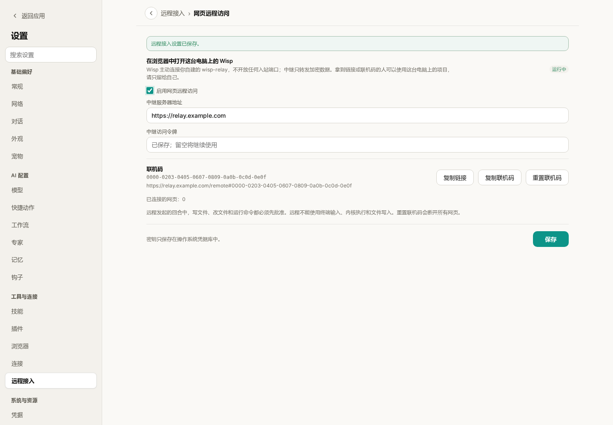
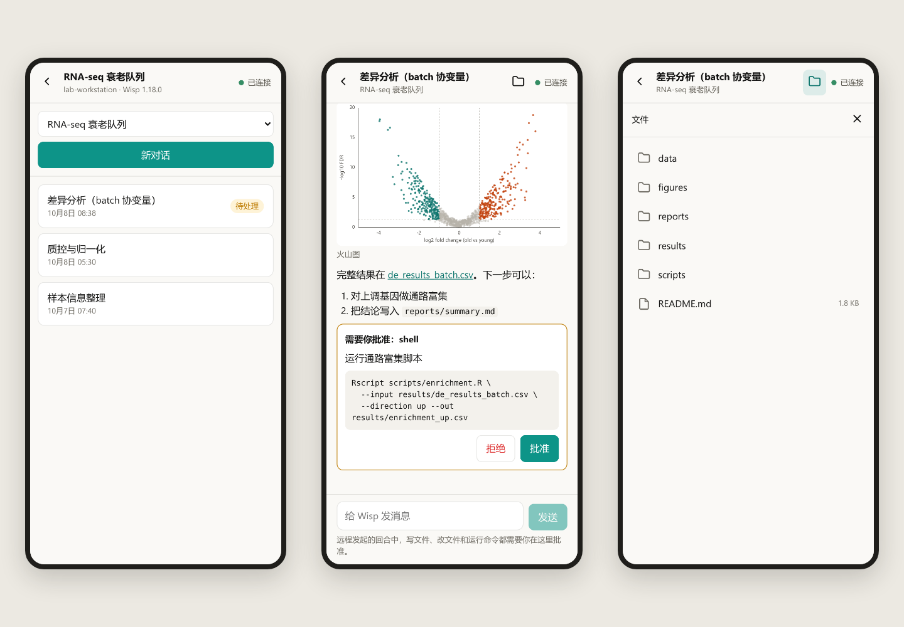
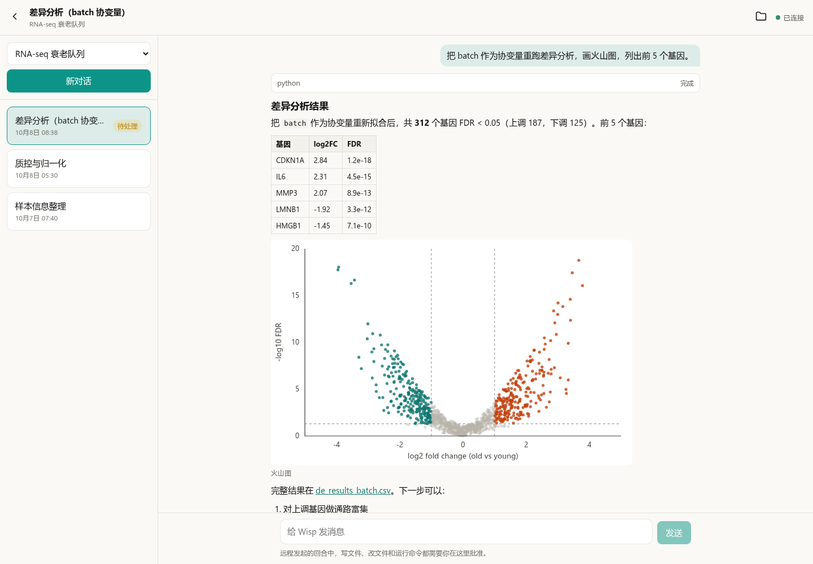
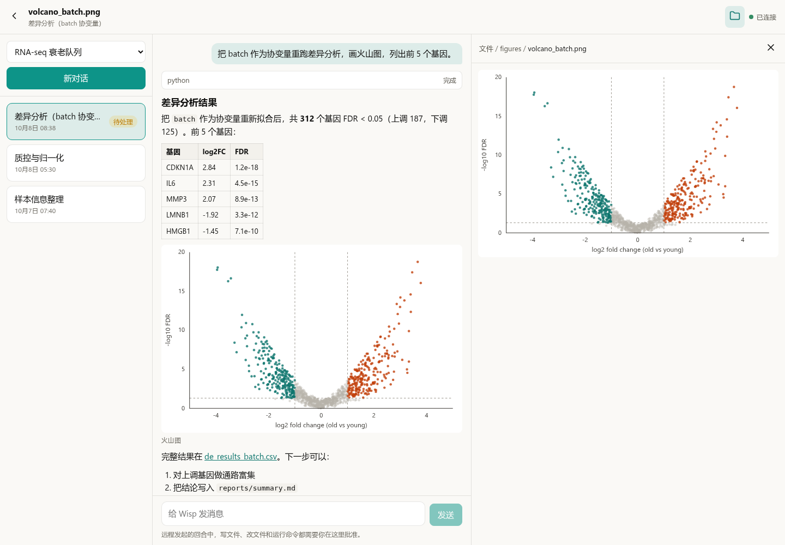

# Wisp Science高级用法：用手机和浏览器远程使用 Wisp

分析任务跑在实验室的工作站上，人却在会议室、食堂，或者回家的地铁上。这时想做的往往只有三件事：看一眼跑到哪了，看看刚出的图，点一下“批准”让它继续。为这点事专程回到电脑前并不划算。

Wisp Science 的**网页远程访问**解决的就是这段距离：在手机或任何浏览器里打开一个网页，直接使用电脑上正在运行的 Wisp，切换项目和对话、读回复、看图、预览文件、发消息、处理审批。计算、文件和模型调用仍然发生在那台电脑上，网页只是它的一扇窗。

这篇文章从部署一台中继服务器开始，接着在桌面端开启远程访问，最后介绍手机和电脑浏览器里各能做什么，以及它刻意不做什么。

> 本文配图来自实际前端，项目、对话、图表和文件均为演示数据。`relay.example.com` 是占位域名，图中的联机码是示例值，不能用来连接任何电脑。网页远程访问在 v1.18.0 之后加入，需要更新的桌面端版本。

**先认识三个角色。**

```
手机 / 浏览器 ──HTTPS──▶ 中继服务器 ◀──主动连出── 电脑上的 Wisp
```

| 角色 | 在哪里 | 负责什么 |
| --- | --- | --- |
| 桌面端 Wisp | 你的电脑或工作站 | 真正干活：运行 Agent、读写文件、调用模型 |
| 中继服务器 `wisp-relay` | 一台有域名的公网服务器 | 让网页和电脑“碰头”，只转发加密后的数据 |
| 网页 | 手机或任意浏览器 | 显示内容，发送你的指令 |

电脑是主动连出去的，不需要公网 IP，也不用在路由器上开端口。中继看不到对话内容，也拿不到联机码，它转发的每一帧都是密文。一台中继可以同时服务多台电脑，各自用自己的联机码区分。

**第一步：在服务器上部署中继。**

需要一台能从外网访问的服务器、一个解析到它的域名，并放行 80 和 443 端口。浏览器只允许在 HTTPS 页面里使用加密功能，所以中继前面必须有 HTTPS；下面的配置用 Caddy 自动申请和续期证书。

把这段内容保存为 `compose.yaml`，把 `relay.example.com` 换成你的域名：

```yaml
services:
  relay:
    image: ghcr.io/xuzhougeng/wisp-relay:latest
    restart: unless-stopped
    environment:
      WISP_RELAY_TOKEN: ${WISP_RELAY_TOKEN:?set a long random token}
    volumes:
      - relay-data:/data
  caddy:
    image: caddy:2
    restart: unless-stopped
    command: caddy reverse-proxy --from relay.example.com --to relay:8787
    ports:
      - "80:80"
      - "443:443"
    volumes:
      - caddy-data:/data
volumes:
  relay-data:
  caddy-data:
```

然后生成访问令牌并启动：

```bash
echo "WISP_RELAY_TOKEN=$(openssl rand -hex 32)" > .env
docker compose up -d
```

`.env` 里的令牌稍后要填进桌面端，请像密码一样保管。只有持有令牌的电脑才能登记到这台中继，陌生人无法把它当作免费的隧道。

镜像同时支持 x86 和 ARM 服务器。`latest` 对应最新正式版；如果桌面端是从开发分支构建的，或者拉取时提示 `latest: not found`（该标签要等下一个正式版发布后才会出现），把镜像标签换成 `:main`。服务器上已经有 nginx 等反向代理，或者想自己构建镜像时，参见文末的参考文档。

**第二步：在桌面端开启远程访问。**

打开 **设置 → 远程接入 → 网页远程访问**，填写中继服务器地址（`https://你的域名`）和刚才的访问令牌，勾选 **启用网页远程访问**。



*图 1：状态显示“运行中”表示电脑已经连上中继。图中的地址和联机码都是演示值；令牌保存后不会再显示在输入框里。*

状态变为“运行中”后，页面会显示一个**联机码**和一条完整链接。点击 **复制链接**，把它发到自己的手机上。

- 联机码就是钥匙。拿到链接或联机码的人可以使用这台电脑上的项目，请只留给自己。
- 令牌和联机码保存在操作系统的凭据库中，不写入项目数据。
- 怀疑链接外泄时，点击 **重置联机码**：旧链接立即失效，已经打开的网页全部断开。
- 远程访问期间，电脑上的 Wisp 需要保持运行。

**第三步：在手机上打开。**

在手机浏览器里打开刚才的链接；也可以访问 `https://你的域名/remote`，手动输入联机码。右上角显示“已连接”就可以用了。



*图 2：手机上一次显示一栏。左：一个项目下的对话列表；中：对话底部等待你处理的审批；右：这条对话所在项目的文件。*

手机屏幕窄，页面一次只显示一栏，左上角的返回箭头逐级退出。浏览器自带的后退同样有效，刷新或收藏之后会回到同一条对话。

| 想做的事 | 怎么做 |
| --- | --- |
| 换一个项目 | 顶部的项目下拉框 |
| 换一条对话 | 对话列表；带“运行中”“待处理”标记的优先看 |
| 开一条新对话 | 列表上方的 **新对话** |
| 让它继续或停下 | 在输入框发消息；运行中可以点 **停止** |
| 处理审批 | 对话底部的审批卡片会显示完整的命令或改动，点 **批准** 或 **拒绝** |

**在电脑浏览器里，三栏同时展开。**



*图 3：屏幕够宽时，左侧是当前项目的对话，中间是对话内容。示例中的基因、数值和火山图都是演示数据。*

回复按 Markdown 渲染，表格、列表、代码和链接都能正常显示，回复里的图片直接出现在对话中。打开一条已经结束的对话，它在桌面端的“待处理”标记也会一并消除。

**文件夹按钮：看看它刚写出了什么。**

点击右上角的文件夹按钮，右侧会打开这条对话所在项目的文件夹，可以逐级浏览。回复里指向项目文件的链接，点一下也会在这里打开。



*图 4：文件面板和对话并排显示，顶部的路径可以点击返回上一级。*

| 文件类型 | 网页里看到的 |
| --- | --- |
| 文本、代码、CSV、日志 | 文本内容；大文件只显示开头 1 MB |
| Markdown | 渲染后的文档 |
| PNG、JPG 等图片 | 缩略图，最长边 1024 像素 |
| PDF、Word、PPT、Excel | 桌面端提取出的文字，不是原始版式 |
| 其他二进制文件 | 提示无法预览，请在桌面端打开 |

文件面板是只读的，不能上传、下载、改名或删除。打开的文件夹会自动刷新，Agent 新写出的文件稍等几秒就会出现。

**远程操作的安全边界。**

把一台能读写文件、运行命令的电脑接到网页上，需要比本地更保守。Wisp 的做法是：

- **远程发起的回合一律先问。** 从网页发出的消息，写文件、改文件和运行命令都必须经过你批准，即使桌面端平时设置为自动允许。批准只对当前这一次生效。
- **能做的事是一张短名单。** 列出项目和对话、读对话、新建对话、发送、停止、审批、浏览和预览文件。终端输入、Python／R 内核执行、保存或修改文件、上传附件和 ACP 对话都不能远程使用。
- **文件内容不出电脑。** 除了文本预览和图片缩略图，文件的原始内容不会发送给网页。
- **中继只见密文。** 联机码放在链接的 `#` 之后，浏览器不会把这一段发给任何服务器；数据在网页和电脑之间端到端加密。

**它不是完整的客户端。**

网页远程访问的定位，是人不在电脑前时的应急入口。切换模型、计划模式、运行卡片、终端、Notebook、更早的历史消息、PDF 原样渲染和文件下载，都留在桌面端。页面靠定时刷新获取进展（任务运行时约 1.5 秒一次），没有消息推送。

**遇到问题时，先看这几项。**

| 现象 | 先检查什么 |
| --- | --- |
| 页面显示“电脑离线” | 电脑上的 Wisp 是否在运行，远程访问是否仍为“运行中” |
| 桌面端迟迟连不上 | 中继地址是否以 `https://` 开头，令牌是否与 `.env` 一致；电脑能否直接访问该域名（桌面端连接中继暂不支持代理） |
| 提示联机码格式不正确 | 联机码是 32 位十六进制；重置之后要使用新的链接 |
| 提示必须使用 HTTPS | 用 `https://` 打开页面；只有 `localhost` 允许 HTTP |
| 发送失败 | 输入的内容会保留；先刷新确认上一条是否已经送达，再决定是否重发 |

第一次使用可以只完成四件事：启动中继、在桌面端看到“运行中”、用手机打开链接、在手机上批准一次操作。确认这条链路通了，再把它当作日常的远程入口。

项目与下载：[Wisp Science](https://github.com/xuzhougeng/wisp-science)

继续阅读：[科研助理](wisp-science-research-assistant.md) · [服务器环境配置](wisp-science-servers-cli.md) · [快速开始](wisp-science-quick-start.md)

> 部署细节（nginx 反向代理、自行构建镜像、数据备份）和完整的安全模型见[网页远程访问参考文档](../remote-access.md)。本文依据撰写时的项目实现整理，不同版本的界面文字可能略有差异。
