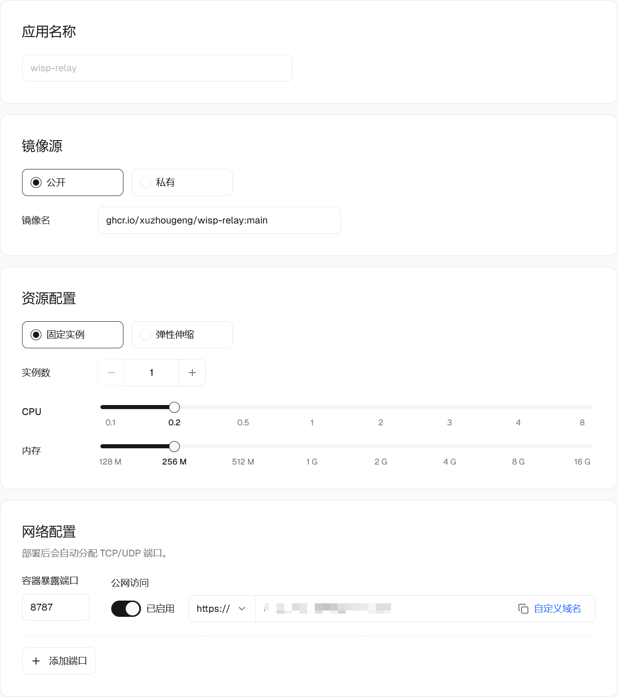

# 在 Sealos 部署 Wisp 网页远程访问

把 Wisp 的中继服务部署到 Sealos 后，就可以通过手机或浏览器访问电脑上的 Wisp，查看对话、发送消息、预览文件和处理审批。下面从创建应用开始，完成中继部署、桌面端连接和浏览器验证。

整个连接方式是：

```text
手机／浏览器 ←→ Sealos 中继服务 ←→ 电脑上的 Wisp
```

Sealos 负责提供网页和转发加密数据，Agent、模型调用和计算任务仍在你的电脑上执行。因此，远程使用时，**电脑需要保持联网、避免休眠，Wisp 需要保持运行**。电脑主动连接中继，不需要公网 IP，也不用在路由器上开放入站端口。

> 本文基于 2026 年 10 月 8 日的部署操作。Sealos 配图中的域名已遮挡，Wisp 设置图使用仓库中的演示截图。桌面端需要支持“网页远程访问”功能；该功能在 v1.18.0 之后加入。

**第一步：创建应用。**

登录 Sealos，进入「应用管理」，点击「创建应用」。按下面的内容填写，操作入口可以参考 [Sealos Docker 镜像部署文档](https://sealos.run/docs/getting-started/deploy-docker-image)。

| 配置项 | 填写内容 |
| --- | --- |
| 应用名称 | `wisp-relay` |
| 镜像源 | 公开 |
| 镜像名 | `ghcr.io/xuzhougeng/wisp-relay:main` |
| 部署模式 | 固定实例 |
| 实例数 | `1` |
| CPU | `0.2` 核 |
| 内存 | `256 M` |

本次部署核实时，镜像仓库只有 `main` 标签，使用 `latest` 会出现 `not found`。因此，本教程使用已验证可拉取的 `main` 镜像。`main` 会随开发分支更新；后续正式版镜像可用时，可以改用明确的版本标签固定版本。

截图中的资源配置可以作为个人使用的起点，后续根据实际用量调整。实例数保持为 **1**，因为当前中继在单个进程内维护电脑与浏览器的连接配对，多实例可能使两端连接到不同的进程。

**第二步：配置网络。**

在「网络配置」中填写：

| 配置项 | 填写内容 |
| --- | --- |
| 容器暴露端口 | `8787` |
| 公网访问 | 开启 |
| 访问协议 | `https://` |



*图 1：本次成功部署使用的基础配置和网络配置，公网域名已遮挡。*

Sealos 会分配一个公网域名，后面需要把这个地址填进 Wisp。本次部署使用截图中的 **HTTPS 入口**，已经成功建立远程连接，沿用此配置即可。Sealos 负责 HTTPS 入口，不需要另外部署 Caddy 或手动配置证书。

网页远程访问同时使用 HTTPS 页面和 WSS 长连接。如果以后添加自己的反向代理，需要保证同一个域名下的 WebSocket 请求也能转发到容器的 `8787` 端口。

**第三步：配置环境变量。**

展开「高级配置」，将「启动命令」和「Arguments」留空，使用镜像自带的启动方式。

添加以下环境变量：

| Key | Value |
| --- | --- |
| `WISP_RELAY_TOKEN` | 自己生成的一段长随机令牌 |
| `WISP_RELAY_BIND` | `0.0.0.0:8787` |
| `WISP_RELAY_ROOT` | `/data` |

如果本地有 OpenSSL，可以在终端用下面的命令生成令牌：

```bash
openssl rand -hex 32
```

Windows 没有安装 OpenSSL 时，也可以在 PowerShell 中生成：

```powershell
$bytes = New-Object byte[] 32
$rng = [System.Security.Cryptography.RandomNumberGenerator]::Create()
$rng.GetBytes($bytes)
$rng.Dispose()
([System.BitConverter]::ToString($bytes)).Replace('-', '').ToLowerInvariant()
```

将输出复制到 `WISP_RELAY_TOKEN` 的值中，并保存好，桌面端需要填写同一个令牌。

**仅使用网页远程访问时，不要新增 `/data` 本地存储挂载。** 保留 `WISP_RELAY_ROOT=/data` 环境变量即可，程序会使用镜像内已有的可写目录。

网页远程访问不需要持久化数据。额外挂载存储卷可能覆盖镜像原有的目录权限，导致容器启动时无法创建目录。如果以后需要项目同步，再单独配置持久化存储，并确保容器用户 `10001:10001` 有写入权限。

**第四步：部署并检查。**

点击部署，等待实例进入运行状态。

假设 Sealos 分配的地址是 `https://你的应用域名`，先在浏览器打开：

```text
https://你的应用域名/healthz
```

显示 `ok`，说明中继服务可以访问。再打开：

```text
https://你的应用域名/remote
```

应看到网页远程访问页面。注意，**网页入口是 `/remote`**，不要只用根地址判断服务是否正常。

**第五步：连接电脑上的 Wisp。**

打开 Wisp，进入 **设置 → 远程接入 → 网页远程访问**，填写：

| 配置项 | 填写内容 |
| --- | --- |
| 中继服务器地址 | `https://你的应用域名` |
| 中继访问令牌 | 部署时设置的 `WISP_RELAY_TOKEN` |
| 启用网页远程访问 | 勾选 |

中继服务器地址只填域名，**不要加 `/remote`**。点击「保存」。


*图 2：桌面端设置示意图，域名和联机码均为演示值。*

连接成功后，右侧会显示 **“运行中”**，下方会出现联机码和远程访问链接。

这里的两种凭据用途不同：

- **中继访问令牌**：让电脑上的 Wisp 连接到中继，由你在部署时设置。
- **联机码**：让浏览器连接到这台电脑上的 Wisp，由桌面端自动生成。

**第六步：在手机或浏览器中使用。**

点击 Wisp 中的「复制链接」，在手机或其他浏览器打开。链接形式如下：

```text
https://你的应用域名/remote#你的联机码
```

也可以打开 `/remote` 页面，手动输入联机码。当桌面端显示 **“已连接的网页：1”**，说明已有一个网页接入。

现在可以在网页上打开一个对话、发送一条消息，确认回复能正常显示。远程发起的写文件、改文件和运行命令仍需审批，可以在网页上处理。

联机码和完整访问链接具有访问权限，请像密码一样保管。分享截图前，遮住令牌、联机码和链接中 `#` 后面的内容。链接泄露时，在桌面端点击「重置联机码」，再复制新链接；旧链接会失效，已连接的网页会断开。

**常见问题。**

| 现象 | 排查方式 |
| --- | --- |
| 拉取镜像提示 `latest: not found` | 使用本教程的 `ghcr.io/xuzhougeng/wisp-relay:main`，或确认目标版本标签已经发布 |
| 提示 `Back-off restarting failed container` | 查看应用日志；它表示容器反复退出，具体原因以日志为准，有“上一次运行日志”时优先查看 |
| 日志提示令牌缺失或为空 | 检查 `WISP_RELAY_TOKEN` 是否填写并保存 |
| 日志提示 `Permission denied` | 检查 `/data` 挂载权限；新建且没有同步数据、仅用于 remote web 的应用可移除该挂载，已有同步数据时先保留存储并修复权限 |
| `/healthz` 正常，但 Wisp 连不上 | 核对中继地址、令牌，以及电脑到该域名的网络连接；使用自定义代理时检查 WebSocket 转发 |
| 网页显示电脑离线 | 确认电脑未休眠、Wisp 正在运行且远程访问显示“运行中” |

继续阅读：[用手机和浏览器远程使用 Wisp](wisp-science-remote-web.md) · [网页远程访问部署参考](../remote-access.md) · [项目同步](../project-sync.md)
