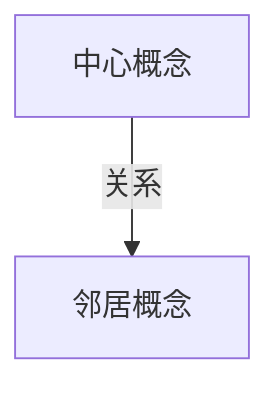

# bear-* 输出体系

每次运行产出**四个文件**，并在终端直接打印结果。文件保存在当前目录下以话题命名的子文件夹里：

```
{topic-slug}/
├── report.md        ← Markdown 报告（bear-map 同名）
├── report.html      ← HTML 报告（bear-map 改为 map.html）
└── references.bib   ← BibTeX 文件，包含本次报告引用的所有文献
```

`references.bib` 是默认输出，不需要用户加 flag。生成逻辑：
1. `sci search` 每次执行都会自动生成 `{prefix}-{timestamp}.bib`
2. 检索结束后，把所有 query 生成的 `.bib` 文件合并
3. 去重（按 DOI 或 title 去重），只保留最终报告中实际引用的文献条目
4. 写入 `{topic-slug}/references.bib`

BibTeX key 格式沿用 sci CLI 的输出（通常是 `authorYEARkeyword`），不要手动修改。
`report.md` 的 YAML front matter 里 `output_files` 加 `bibtex: "references.bib"`。

文件命名示例：用户输入"睡眠对记忆的作用"→ 文件夹命名 `sleep-memory/`，bib 文件为 `sleep-memory/references.bib`。

## 1. 终端输出（TUI）

直接 print，无需写文件。格式已在各 SKILL.md 的「输出格式」节定义。

## 2. Markdown 报告（report.md）

Markdown 是给用户存档、复制到写作工具、继续加工和机器解析的输出。它不是终端输出的转写，也不是 HTML 的简化版。

每份 `report.md` 必须同时满足两件事：

1. 人能在 30 秒内读出结论
2. 后续 agent 或脚本能稳定抽取主张、文献、判断、查询词和空结果

第三个隐性目标同样重要：科研用户读完后最好知道下一步怎么用这些结果。但建议强度要随用户场景变化。

默认简单查询：只给 1 到 2 条轻量下一步，例如"优先读 E1"、"如果要写进论文，可再补查 q2"。

明确科研工作流：给 2 到 5 条具体研究动作建议，例如引用哪篇、降低哪个断言、补查哪个人群、怎样回应审稿人。

### Front matter

使用稳定字段，字段名不要随技能变化。无法取得的字段用空数组或空字符串，不要删除字段。

```yaml
---
skill: bear-support
topic: "用户输入的原始主张或主题"
date: YYYY-MM-DD
generated_at: YYYY-MM-DDTHH:mm:ssZ
query_count: 3
result_count: 8
empty_result_count: 1
output_files:
  markdown: "report.md"
  html: "report.html"
  bibtex: "references.bib"
source_policy: "All papers, authors, and claims come from this session's sci search results."
queries:
  - id: q1
    label: "直接支撑"
    query: "actual query"
    mode: "low"
    result_count: 10
    useful_count: 3
---
```

`bear-map` 的 `output_files.html` 写 `map.html`。所有 skill 的 `output_files.bibtex` 统一写 `references.bib`。

### 正文结构

所有 Markdown 报告使用固定二级标题，便于 Obsidian、GitHub、Pandoc 和后续 agent 处理。

````markdown
# {TOPIC}

> 一句话结论：{最重要发现}
> 可信边界：所有结果来自本次 sci search；未检索到的内容没有补写。

## 1. 一眼结论

| 指标 | 值 |
|---|---|
| 有效文献 | N |
| 检索方向 | N |
| 总体信号 | 强 / 中 / 弱 / 混合 |
| 空结果 | N |

{2 到 4 句解释本次结果意味着什么，以及不能说明什么。}

## 2. 核心发现

{技能专属的结构化摘要，见下方各技能模板。}

## 3. 研究动作建议

| 场景 | 建议动作 | 依据 |
|---|---|---|
| 写 introduction | 优先引用 E1，再用 E2 补机制 | E1 直接支撑主张 |
| 改 discussion | 加一句适用边界 | E3 只支持特定条件 |
| 下一轮检索 | 用更窄的关键词补查人群差异 | q2 空结果 |

简单查询时，本节可以改名为 `## 3. 下一步`，只保留 1 到 2 行。明确写作、审稿、开题、入门或 grant 场景时，使用完整 `## 3. 研究动作建议`。

只写用户能立刻执行的动作，不写泛泛的"继续研究"。

## 4. 证据表

| ID | 类型 | 强度 | 作者年份 | 标题 | DOI | 关系说明 | Query |
|---|---|---|---|---|---|---|---|
| E1 | 直接支撑 | 强 | Smith 2023 | Title | 10.xxxx/xxxx | 一句话说明 | q1 |

## 5. 详细证据

### E1. Smith 2023

**标题**：[Title](https://doi.org/10.xxxx/xxxx)
**类型**：直接支撑
**强度**：强
**对应查询**：q1，actual query
**关系说明**：这篇文献如何支持、威胁、靠近或推动主题。

<details>
<summary>摘要</summary>

将 abstract 字段的英文内容按学术论文翻译规范改写为中文后输出（保留专业术语的准确性，句式符合中文学术论文表达习惯，不要逐字直译）。没有 abstract 时省略整个 details。

</details>

## 6. 检索透明度

| Query ID | 方向 | Query | Mode | 返回 | 采用 | 说明 |
|---|---|---|---|---:|---:|---|
| q1 | 直接支撑 | actual query | low | 10 | 3 | 采用 3 篇直接相关 |

### 空结果与缺口

| 方向 | Query | 说明 |
|---|---|---|
| 复制失败 | actual query | 未检索到可用证据 |

## 7. 可复用数据

```json
{
  "evidence": [
    {
      "id": "E1",
      "type": "direct_support",
      "strength": "strong",
      "authors_year": "Smith 2023",
      "title": "Title",
      "doi": "10.xxxx/xxxx",
      "query_id": "q1",
      "relation": "..."
    }
  ]
}
```
````

### Markdown 写作规则

- 保留 `## 1.` 到 `## 7.` 的标题顺序，不要改名
- 所有文献必须有稳定 ID：`E1`、`E2`、`E3`
- 所有查询必须有稳定 ID：`q1`、`q2`、`q3`
- 表格列名保持一致，缺失 DOI 写空字符串
- 关系说明写”这篇文献和用户问题的关系”，不要复述摘要
- 摘要内容（`<details>` 块和 Markdown `> ` 引用块）必须将英文 abstract 按学术论文翻译规范改写为中文；专业术语保持准确，不要逐字直译，也不要保留英文原文
- 空结果必须进入「空结果与缺口」，不要删掉
- 简单查询只给轻量下一步；明确科研工作流才给完整研究动作建议
- 研究动作建议必须具体到科研写作或研究决策，如引用哪篇、降低哪个断言、补查哪个人群、怎样回应审稿人
- JSON 代码块只放用于后续处理的轻量字段，不要塞完整 abstract
- 如果用户需要 BibTeX，把 BibTeX 放在单独 `.bib` 文件；Markdown 里只链接或标注文件名

### 各技能 Markdown 核心发现模板

#### bear-support：证据阶梯

```markdown
## 2. 核心发现

### 首选引用

**E1 Smith 2023** 最适合优先引用，因为……

### 证据阶梯

| 层级 | 文献 ID | 判断 |
|---|---|---|
| 直接支撑 | E1, E2 | 可直接支撑主张 |
| 部分支撑 | E3 | 支撑局部机制或条件 |
| 间接相关 | E4 | 只能作为背景引用 |

### 未获支持的主张

| 主张 | 检索情况 | 建议 |
|---|---|---|
| claim text | 未找到直接支持 | 换更窄查询或降低断言强度 |

### 怎么用这些文献

| 写作位置 | 建议 |
|---|---|
| Introduction | 用 E1 支撑核心背景句 |
| Discussion | 用 E3 限定适用边界 |
| 下一轮检索 | 针对未获支持主张改写 query |
```

#### bear-counter：威胁矩阵

```markdown
## 2. 核心发现

### 最危险反证

**E1 Smith 2023** 是最高威胁，因为……

**回应方向**：需要展示……

### 威胁矩阵

| 挑战类型 | 最高威胁 | 文献 ID | 回应方向 |
|---|---|---|---|
| 直接矛盾 | 高 | E1 | 需要解释人群或测量差异 |
| 边界条件 | 中 | E2 | 限定适用范围 |
| 替代解释 | 中 | E3 | 增加机制证据 |
| 方法批评 | 低 | E4 | 报告稳健性检查 |
| 复制失败 | 无 |  | 未检索到可用反证 |

### 怎么用这些反证

| 用途 | 建议 |
|---|---|
| Discussion | 主动承认 E1 的边界挑战 |
| Reviewer response | 用 E2 解释为什么该挑战不完全适用 |
| 补充分析 | 针对方法批评补稳健性检验 |
```

#### bear-scoop：撞车分层

```markdown
## 2. 核心发现

### 最近撞车候选

**E1 Smith 2023** 离本 idea 最近，因为……

### 撞车分层

| 层级 | 文献 ID | 邻近判断 | 风险 |
|---|---|---|---|
| 直接撞车 | E1 | 问题、方法、结论均接近 | 高 |
| 方法孪生 | E2 | 方法相同，问题不同 | 中 |
| 问题孪生 | E3 | 问题相同，方法不同 | 中 |
| 邻居 | E4 | 主题相关但不重叠 | 低 |

### 空间判断

拥挤区：……

安静区：……

### 选题动作

| 决策 | 建议 |
|---|---|
| 继续推进 | 避开 E1 的问题方法组合 |
| 改题目 | 强调尚未拥挤的场景或数据 |
| 下一轮检索 | 优先补查抢发者标题角度 |
```

#### bear-map：概念邻接表

````markdown
## 2. 核心发现

### 中心概念解释

{3–5 句，行内标注 [E1], [E2]。说清楚三件事：它是什么（核心机制或工作原理）、它解决什么问题或用在哪、它和邻近概念之间最核心的连接。}

### 邻接表

| 邻居概念 | 关系 | 支撑文献 | 是什么 | 与中心的连接 |
|---|---|---|---|---|
| Concept A | 提供方法 | E1, E3 | 2–3 句，说清楚这个概念的核心内容和工作原理 | 1 句，为什么它在这张地图上 |

### Mermaid 概念图



### 推荐入门

| 顺序 | 文献 ID | 推荐理由 |
|---:|---|---|
| 1 | E1 | 定义中心概念 |

### 学习路径

| 步骤 | 做什么 |
|---:|---|
| 1 | 先读 E1 建立中心概念 |
| 2 | 再读 E2 理解关键邻居 |
| 3 | 最后沿邻接表选择下一个子概念 |
````

#### bear-trace：传承链

```markdown
## 2. 核心发现

### 贯穿问题

这个方向一直在重新回答的问题是……

### 传承链

| 顺序 | 年份 | 文献 ID | 转折点 | 改变了什么 |
|---:|---:|---|---|---|
| 1 | 2010 | E1 | 奠定问题 | 一句话 |
| 2 | 2016 | E2 | 方法转向 | 一句话 |
| 3 | 2023 | E3 | 当前前沿 | 一句话 |

### 开放边缘与缺口

| 类型 | 内容 |
|---|---|
| 开放边缘 | 下一步可能走向…… |
| 检索缺口 | 某层证据不足，原因是…… |

### 阅读顺序

| 顺序 | 文献 ID | 为什么先读 |
|---:|---|---|
| 1 | E1 | 奠定问题 |
| 2 | E2 | 解释关键转折 |
| 3 | E3 | 连接当前前沿 |
```

## 3. HTML 报告设计原则

HTML 是给用户读、截图、转发的第一等输出，不是 Markdown 的可视化副本。

页面保持白底优先、低装饰、适合直接截图进 PPT。支持 dark mode，但不要依赖深色视觉完成表达。

**首屏判断优先**：用户打开页面，应该在 5 秒内看到这次检索最重要的发现是什么——最该引用哪篇、最危险的反证在哪里、idea 撞车发生在第几层、这个概念真正连向哪些邻居、谱系的转折点是什么。这个判断不是靠”结论标题”来传达，而是靠信息的组织方式：最重要的一篇卡片视觉上就是最突出的，空结果就是空的，证据强弱就是肉眼可见的。用信息的密度和层次制造判断感，不要写出”本次检索的核心发现是……”这样的说明句。

如果某个技能本身使用多 query 或多角度检索，HTML 必须展示「检索覆盖面」。读者要能一眼看出本次不是只搜了一个词，而是覆盖了哪些维度。覆盖面可以用小卡片或表格呈现，每项包含：维度名、实际 query、mode、有效结果数、该 query 支撑了哪些证据或节点。

## 4. 信息架构

所有技能共用三段式阅读路径：

1. **报告头部**：技能名、主题、日期、检索次数、一句可信边界声明
2. **核心判断区**：`.verdict` + 数字摘要条 + 签名可视化——三者合在一起让用户不读正文就能做决策
3. **证据与透明度**：文献卡、摘要折叠、DOI 链接、查询词、空结果说明

不要把所有文献平铺在首屏。首屏只放判断和可视化，文献卡放在下方。

## 5. 设计 token

```text
字体：system-ui, -apple-system, BlinkMacSystemFont, "Segoe UI", sans-serif
正文：16px / 1.68
小字：13px / 1.5
标题：650 weight
圆角：8px（卡片）/ 999px（pill）/ 6px（按钮与标签）
最大宽度：1040px
正文列宽：720px
间距单位：8px 倍数

浅色
  背景：#f7f8fa
  纸面：#ffffff
  浮层：#f3f4f6
  边框：#d9dee7
  文字：#111827
  次要：#667085
  淡色强调底：color-mix(in srgb, var(--accent) 10%, white)

深色
  背景：#111827
  纸面：#1f2937
  浮层：#263244
  边框：#374151
  文字：#f9fafb
  次要：#b6c0cf
```

各 skill 强调色：

```text
bear-support  #16a34a
bear-counter  #dc2626
bear-scoop    #2563eb
bear-map      #0891b2
bear-trace    #d97706
```

## 6. HTML 外壳

生成自包含单文件，CSS 内嵌，无外部字体、图片、脚本或 CDN。

**字体与尺寸锁定（所有 skill 必须一致，不允许偏差）**：
- body font: `16px/1.68 system-ui, -apple-system, BlinkMacSystemFont, "Segoe UI", sans-serif`
- h1: `clamp(26px, 3.4vw, 38px)` / weight 650
- `.verdict-title`: `22px` / weight 650
- `.metric-value`: `23px` / weight 700
- `.card-title`: `17px` / weight 650
- `.section-title`: `14px` / weight 800，uppercase，color var(--muted)
- `.card-sub`, `.bar-label`, `.bar-text`, `.insight`: `14px`
- `.meta`, `.abstract-text`, `details.abstract`: `13px`～`14px`
- `.skill-tag`, `.pill`, `.query`, `.metric-label`, `.footer`: `13px`
- 颜色 token 严格使用 `--bg #f7f8fa`、`--paper #ffffff`、`--surface #f3f4f6`、`--border #d9dee7`、`--text #111827`、`--muted #667085`
- 不使用 `.5px` 的非整数字号（如 `12.5px`、`13.5px`、`14.5px`、`15.5px`）
- 不使用非标准 weight（如 `650`、`720`——只用 `400`、`600`、`700`、`800`）
- 不自定义字体栈（不引入 SF Pro Text、Helvetica Neue 等）

允许极少量 vanilla JS，只用于 tabs、复制 BibTeX、展开全部摘要、按证据类型筛选。没有 JS 时，报告仍必须能完整阅读。

```html
<!DOCTYPE html>
<html lang="zh">
<head>
<meta charset="UTF-8">
<meta name="viewport" content="width=device-width, initial-scale=1">
<title>{SKILL_NAME} · {TOPIC}</title>
<style>
*, *::before, *::after { box-sizing: border-box; }
html { background: var(--bg); }
body {
  margin: 0; background: var(--bg); color: var(--text);
  font: 16px/1.68 system-ui, -apple-system, BlinkMacSystemFont, "Segoe UI", sans-serif;
  letter-spacing: 0; padding: 32px 18px 56px;
}
:root {
  --bg: #f7f8fa; --paper: #ffffff; --surface: #f3f4f6;
  --border: #d9dee7; --text: #111827; --muted: #667085;
  --accent: {ACCENT_COLOR}; --danger: #dc2626;
  --radius: 8px; --shadow: 0 18px 45px rgba(15, 23, 42, .08);
}
@media (prefers-color-scheme: dark) {
  :root {
    --bg: #111827; --paper: #1f2937; --surface: #263244;
    --border: #374151; --text: #f9fafb; --muted: #b6c0cf;
    --shadow: 0 18px 45px rgba(0, 0, 0, .28);
  }
}
.container { max-width: 1040px; margin: 0 auto; }
.report-header {
  background: var(--paper); border: 1px solid var(--border);
  border-radius: var(--radius); padding: 28px 32px; box-shadow: var(--shadow);
}
.tagline { display: flex; gap: 10px; flex-wrap: wrap; align-items: center; margin-bottom: 14px; }
.skill-tag {
  display: inline-flex; align-items: center; min-height: 28px; padding: 3px 10px;
  border-radius: 999px; color: #fff; background: var(--accent);
  font-size: 13px; font-weight: 700;
}
.meta { color: var(--muted); font-size: 14px; }
h1 { margin: 0; font-size: clamp(26px, 3.4vw, 38px); line-height: 1.14; font-weight: 650; max-width: 820px; }
.boundary { margin-top: 16px; color: var(--muted); max-width: 760px; font-size: 15px; }
.verdict {
  margin-top: 22px; display: grid; grid-template-columns: minmax(0, 1.2fr) minmax(220px, .8fr);
  gap: 18px; align-items: stretch;
}
.verdict-main, .metric-strip {
  background: var(--paper); border: 1px solid var(--border); border-radius: var(--radius);
}
.verdict-main { padding: 24px 28px; border-left: 5px solid var(--accent); }
.eyebrow { color: var(--accent); font-size: 13px; font-weight: 800; letter-spacing: .06em; text-transform: uppercase; }
.verdict-title { margin-top: 8px; font-size: 22px; line-height: 1.34; font-weight: 650; }
.verdict-note { margin-top: 10px; color: var(--muted); font-size: 15px; }
.metric-strip { display: grid; grid-template-columns: repeat(2, minmax(0, 1fr)); overflow: hidden; }
.metric { padding: 18px; border-right: 1px solid var(--border); border-bottom: 1px solid var(--border); }
.metric:nth-child(2n) { border-right: 0; }
.metric:nth-last-child(-n+2) { border-bottom: 0; }
.metric-value { font-size: 23px; font-weight: 700; color: var(--accent); line-height: 1.1; }
.metric-label { margin-top: 5px; color: var(--muted); font-size: 13px; }
.section { margin-top: 26px; }
.section-title { margin: 0 0 12px; font-size: 14px; font-weight: 800; color: var(--muted); letter-spacing: .06em; text-transform: uppercase; }
.panel, .card {
  background: var(--paper); border: 1px solid var(--border); border-radius: var(--radius);
  box-shadow: 0 8px 22px rgba(15, 23, 42, .04);
}
.panel { padding: 24px; }
.card { padding: 20px 22px; margin-bottom: 14px; }
.card-title { font-weight: 650; font-size: 17px; line-height: 1.38; }
.card-sub { color: var(--muted); font-size: 14px; margin-top: 4px; }
.card-body { margin-top: 12px; font-size: 15px; }
.insight { margin-top: 10px; padding-left: 14px; border-left: 3px solid var(--accent); }
.response { margin-top: 10px; color: var(--muted); }
.bar-wrap { display: grid; grid-template-columns: 70px 1fr 42px; align-items: center; gap: 12px; margin: 12px 0; }
.bar-label { font-size: 14px; color: var(--muted); }
.bar-track { height: 8px; background: var(--surface); border-radius: 999px; overflow: hidden; }
.bar-fill { height: 100%; width: var(--bar, 50%); background: var(--accent); border-radius: 999px; }
.bar-text { font-size: 14px; font-weight: 700; color: var(--accent); }
.pill-row { display: flex; flex-wrap: wrap; gap: 8px; margin-top: 12px; }
.pill, .query {
  display: inline-flex; align-items: center; min-height: 28px; padding: 2px 10px;
  border: 1px solid var(--border); border-radius: 999px;
  background: var(--surface); color: var(--muted); font-size: 13px;
}
.doi-link { color: var(--accent); text-decoration: none; font-weight: 650; }
.doi-link:hover { text-decoration: underline; }
details.abstract, details.query-log {
  margin-top: 12px; border-top: 1px dashed var(--border); padding-top: 10px;
  font-size: 14px; color: var(--muted);
}
details summary { cursor: pointer; color: var(--accent); font-weight: 700; }
.abstract-text { margin-top: 8px; }
.empty {
  color: var(--muted); background: var(--surface); border: 1px dashed var(--border);
  border-radius: var(--radius); padding: 14px 16px; font-size: 15px;
}
.tabs { display: grid; gap: 14px; }
.tab-controls { display: flex; gap: 8px; flex-wrap: wrap; }
.tab-controls button, .tool-button {
  border: 1px solid var(--border); border-radius: 999px; padding: 7px 12px;
  background: var(--paper); color: var(--text); font: inherit; font-size: 14px; cursor: pointer;
}
.tab-controls button[aria-selected="true"], .tool-button:hover {
  border-color: var(--accent); color: var(--accent);
}
.grid-2 { display: grid; grid-template-columns: repeat(2, minmax(0, 1fr)); gap: 16px; }
.footer {
  margin-top: 38px; color: var(--muted); font-size: 13px;
  border-top: 1px solid var(--border); padding-top: 16px;
}
/* 最重要的一张卡片：视觉权重高于其他卡片 */
.card-primary {
  border-color: var(--accent); border-width: 1.5px;
  background: color-mix(in srgb, var(--accent) 4%, var(--paper));
}
@media (max-width: 760px) {
  body { padding: 18px 12px 40px; font-size: 16px; }
  .report-header, .verdict-main, .panel, .card { padding: 18px; }
  .verdict, .grid-2, .reader-brief { grid-template-columns: 1fr; }
  .metric-strip { grid-template-columns: repeat(2, minmax(0, 1fr)); }
  .bar-wrap { grid-template-columns: 62px 1fr 38px; gap: 8px; }
}
@media print {
  body { background: #fff; color: #111827; padding: 0; }
  .container { max-width: none; }
  .report-header, .panel, .card, .verdict-main, .metric-strip { box-shadow: none; break-inside: avoid; }
  .tab-controls, .tool-button { display: none; }
}
</style>
</head>
<body>
<div class="container">
  <header class="report-header">
    <div class="tagline">
      <span class="skill-tag">{SKILL_NAME}</span>
      <span class="meta">{DATE} · {QUERY_COUNT} 次真实检索</span>
    </div>
    <h1>{TOPIC}</h1>
    <p class="boundary">所有论文、作者和结论均来自本次 `sci search`；未检索到的内容不会补写。</p>
  </header>

  <!-- 插入一眼结论、签名可视化、证据卡片和检索日志 -->

  <footer class="footer">由 {SKILL_NAME} 生成 · 底层检索：scimaster-cli · 真实检索优先于完整叙事</footer>
</div>
</body>
</html>
```

## 7. 通用组件

### 核心判断区

`.verdict` 呈现该技能最核心的一个判断——不是"这次检索很重要"，而是一个具体的、可操作的结论：首选引用是哪篇、最危险反证是哪篇、idea 落在哪一层、概念的中心关系是什么、谱系的转折在哪里。

`.verdict-note` 写证据边界和局限，不写泛化的"重要性"。

```html
<section class="verdict">
  <div class="verdict-main">
    <div class="eyebrow">[bear-support: 首选引用 / bear-counter: 最高威胁 / bear-scoop: 最近撞车 / bear-map: 中心概念 / bear-trace: 贯穿问题]</div>
    <div class="verdict-title">[具体判断，一句话，不要"本次检索发现……"]</div>
    <div class="verdict-note">[证据边界：这个判断在什么条件下成立，哪里存在不确定性]</div>
  </div>
  <div class="metric-strip">
    <div class="metric"><div class="metric-value">[N]</div><div class="metric-label">有效文献</div></div>
    <div class="metric"><div class="metric-value">[N]</div><div class="metric-label">检索方向</div></div>
    <div class="metric"><div class="metric-value">[强/中/弱]</div><div class="metric-label">总体信号</div></div>
    <div class="metric"><div class="metric-value">[N]</div><div class="metric-label">空结果</div></div>
  </div>
</section>
```

### 文献卡

每个技能中最重要的那张卡（首选引用、最高威胁、最近撞车、关键节点）加 `card-primary` class，使其在视觉上与其他卡片有明确区分。其他卡片保持普通样式。这是信息层次的体现，不需要额外标注"最重要"——卡片本身的视觉权重就是答案。

```html
<!-- 最重要的一张：加 card-primary -->
<article class="card card-primary evidence-card" data-kind="[direct|partial|threat|neighbor]">
  <div class="card-title">[作者 年份] · <a class="doi-link" href="https://doi.org/[DOI]">[论文标题]</a></div>
  <div class="card-sub">[期刊；无则省略]</div>
  <div class="bar-wrap">
    <span class="bar-label">[强度/威胁/邻近]</span>
    <div class="bar-track"><div class="bar-fill" style="--bar:[N]%"></div></div>
    <span class="bar-text">[强/中/弱]</span>
  </div>
  <div class="insight">[这篇文献与用户问题的关系，一句话]</div>
  <div class="pill-row">
    <span class="pill">[分类]</span>
    <span class="query">[实际查询词]</span>
  </div>
  <details class="abstract" open>
    <summary>摘要</summary>
    <div class="abstract-text">[abstract 原文]</div>
  </details>
</article>

<!-- 其他卡片：普通样式，摘要默认折叠 -->
<article class="card evidence-card" data-kind="[direct|partial|threat|neighbor]">
  <div class="card-title">[作者 年份] · <a class="doi-link" href="https://doi.org/[DOI]">[论文标题]</a></div>
  <div class="card-sub">[期刊；无则省略]</div>
  <div class="bar-wrap">...</div>
  <div class="insight">[关系，一句话]</div>
  <div class="pill-row">
    <span class="pill">[分类]</span>
    <span class="query">[实际查询词]</span>
  </div>
  <details class="abstract">
    <summary>摘要</summary>
    <div class="abstract-text">[abstract 原文]</div>
  </details>
</article>
```

DOI 为空时标题为纯文本，不生成 `#` 链接。abstract 为空时省略 `<details>` 整块。

### 检索透明度

每个 HTML 底部必须有「检索透明度」区块：

```html
<section class="section">
  <h2 class="section-title">检索透明度</h2>
  <div class="panel">
    <details class="query-log" open>
      <summary>查看本次实际查询词与空结果</summary>
      <ul>
        <li>[方向] · [query] · [mode] · [有效结果数]</li>
      </ul>
    </details>
  </div>
</section>
```

这块是信任来源，不要省略。

## 8. 各技能签名体验

### bear-support：证据阶梯

`.verdict-title` 写首选引用和原因；`.metric-strip` 显示有效文献数 / 强支持数 / 间接数 / 空结果主张数。文献区 tabs 切换「全部 / 直接 / 部分 / 间接」，首选引用摘要默认展开。

签名组件 CSS（`<style>` 中追加）：
```css
.evidence-ladder { display: grid; gap: 12px; }
.ladder-row { display: grid; grid-template-columns: 140px 1fr; gap: 0; border: 1px solid var(--border); border-radius: var(--radius); overflow: hidden; }
.ladder-label { display: flex; align-items: center; justify-content: center; text-align: center; background: color-mix(in srgb, var(--accent) 12%, var(--paper)); color: var(--accent); font-weight: 700; padding: 14px; font-size: 13px; }
.ladder-items { padding: 14px 16px; }
@media (max-width: 760px) { .ladder-row { grid-template-columns: 1fr; } }
```

### bear-counter：威胁面板

`.verdict-title` 写最危险文献和威胁类型；`.verdict-note` 写一句回应方向；`.metric-strip` 显示高威胁数 / 覆盖类型数 / 空类型数。文献区 tabs 切换五类挑战方向，每张卡片必须包含 `回应：...`。

签名组件 CSS（`<style>` 中追加）：
```css
.threat-board { display: grid; grid-template-columns: 1.1fr 1fr 1fr; gap: 14px; }
.threat-column { min-height: 120px; padding: 16px; border: 1px solid var(--border); border-radius: var(--radius); background: var(--surface); }
.threat-column h3 { margin: 0 0 12px; font-size: 15px; font-weight: 700; }
.threat-column.high { border-color: color-mix(in srgb, var(--danger) 55%, var(--border)); }
@media (max-width: 860px) { .threat-board { grid-template-columns: 1fr; } }
```

### bear-scoop：撞车雷达

`.verdict-title` 写最近撞车候选；`.verdict-note` 写拥挤区和安静区；`.metric-strip` 显示四层文献数。文献区 tabs 切换四层。雷达用 SVG 实现，每篇候选用 `<circle class=”rdot” data-tip=”论文标题”>` 按层放置；悬停 tooltip 用 JS mousemove 实现（禁止用 `<title>`，macOS Chrome/Safari 不显示）。

签名组件 CSS（`<style>` 中追加）：
```css
.radar-wrap { display: grid; grid-template-columns: 340px 1fr; gap: 22px; align-items: center; }
.collision-radar { position: relative; width: 320px; height: 320px; margin: 0 auto; }
.radar-ring { position: absolute; border-radius: 50%; border: 1.5px solid var(--border); }
.ring-direct  { inset: 110px; background: rgba(220,38,38,.10); border-color: #dc2626; }
.ring-method  { inset: 75px; background: rgba(37,99,235,.06); }
.ring-problem { inset: 40px; }
.ring-neighbor{ inset: 0; }
.radar-center { position: absolute; inset: 134px 104px; display: flex; align-items: center; justify-content: center; border-radius: 999px; background: var(--accent); color: #fff; font-size: 13px; font-weight: 800; text-align: center; }
.rdot { cursor: pointer; }
@media (max-width: 860px) { .radar-wrap { grid-template-columns: 1fr; } }
```

### bear-map：概念星图

`.verdict-title` 写中心概念一句话解释；`.metric-strip` 显示邻居数 / 支撑文献数 / 检索次数。SVG 星图中心节点青色填充，邻居节点白底青色边框，边上标关系标签。星图下方必须有邻居说明卡片（是什么 2–3 句 + 与中心连接 1 句），不能只依赖 hover；悬停 tooltip 用 JS mousemove 实现（禁止用 `<title>`）。

签名组件 CSS（`<style>` 中追加）：
```css
.concept-map-wrap { overflow-x: auto; }
.concept-map { width: 100%; min-width: 680px; height: auto; display: block; background: var(--paper); }
.node-center { fill: var(--accent); }
.node-neighbor { fill: var(--paper); stroke: var(--accent); stroke-width: 2; }
.node-label { font: 600 14px system-ui, sans-serif; fill: var(--text); }
.center-label { font: 700 14px system-ui, sans-serif; fill: #fff; }
.edge { stroke: var(--border); stroke-width: 1.5; }
.edge-label { font: 13px system-ui, sans-serif; fill: var(--muted); }
.concept-notes { display: grid; grid-template-columns: repeat(2, minmax(0,1fr)); gap: 10px; margin-top: 14px; }
@media (max-width: 640px) { .concept-notes { grid-template-columns: 1fr; } }
```

### bear-trace：传承时间线

`.verdict-title` 写贯穿问题；`.verdict-note` 写当前前沿和开放边缘；`.metric-strip` 显示时间跨度 / 节点数 / 缺口数。最后一项加 `← 当前前沿` 标签；末尾三张 summary cards：贯穿问题 / 开放边缘 / 检索缺口。

签名组件 CSS（`<style>` 中追加）：
```css
.trace-timeline { display: grid; gap: 16px; }
.tl-item { display: grid; grid-template-columns: 72px 20px 1fr; gap: 10px; align-items: start; }
.tl-year { color: var(--accent); font-size: 20px; font-weight: 800; line-height: 1.2; text-align: right; padding-top: 4px; }
.tl-dot  { width: 14px; height: 14px; margin-top: 6px; border-radius: 50%; background: var(--accent); box-shadow: 0 0 0 4px color-mix(in srgb, var(--accent) 15%, transparent); flex-shrink: 0; }
.tl-card { background: var(--paper); border: 1px solid var(--border); border-radius: var(--radius); padding: 16px 18px; }
.turning-point { color: var(--accent); font-size: 13px; font-weight: 800; margin-bottom: 6px; text-transform: uppercase; letter-spacing: .04em; }
@media (max-width: 640px) { .tl-item { grid-template-columns: 1fr; } .tl-year { text-align: left; font-size: 16px; } }
```

## 9. 生成规则

1. 所有 HTML 必须能单文件离线打开。
2. 不使用外部依赖，不使用远程字体，不引用外部 JS。
3. 首屏必须出现 `.verdict`，不得被其他内容挤到屏幕以下。
4. 正文字体 16px，移动端不低于 15px；文献标题 17px，长标题允许自动换行但不能截断。
5. 每个图表必须可截图，默认浅色背景清晰可读。
6. 文献卡片必须保留 DOI（可点击链接）、摘要（折叠）、查询词三类证据入口；缺失时才省略。摘要内容必须将英文 abstract 字段按学术论文翻译规范改写为中文后输出——保留专业术语准确性，句式符合中文学术表达，不要逐字直译，也不要保留英文原文。abstract 字段为空时整个摘要折叠块省略。
7. 最重要的一张卡片（首选引用、最高威胁、最近撞车、关键传承节点等）加 `.card-primary` class，摘要默认展开；其余卡片摘要默认折叠。
8. 空结果不能删除，作为信号展示。
9. 允许 JS 用于 tabs、证据类型筛选、展开全部摘要。没有 JS 时，报告仍必须能完整阅读。
10. 每页只用该 skill 的强调色，加少量灰阶和必要的危险红。不要用大面积渐变、装饰光斑、多余阴影。
11. 禁止生成"读者模式"切换、"保存为 PDF"按钮、"30秒背景"、"怎么读这份报告"等说明性模块。这些内容信息密度低，让页面看起来像操作说明书而不是检索报告。
12. 多 query 技能必须展示检索覆盖面。`bear-counter` 展示五类挑战查询，`bear-scoop` 展示 5–6 个查重角度，`bear-trace` 展示锚点、前驱和前沿查询，`bear-map` 展示中心概念和补充检索。`bear-support` 单一主张可以单 query；段落模式或多主张按主张分别展示。
